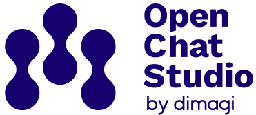

[](https://github.com/dimagi/open-chat-studio)

This repository contains the user documentation for [Open Chat Studio](https://github.com/dimagi/open-chat-studio).

Open Chat Studio is a platform for building, deploying, and evaluating AI-powered chat applications. It provides tools for working with various LLMs (Large Language Models), creating chatbots, managing conversations, and integrating with different messaging platforms.

## Docs Quickstart

Assuming you've already cloned this repository:

1. Install [UV python package and project manager](https://docs.astral.sh/uv/getting-started/installation/)

    ```shell
    curl -LsSf https://astral.sh/uv/install.sh | sh
    ```

2. Set up the project

    ```shell
    uv venv
    uv sync
    ```

3. Install the pre-commit hooks

    ```shell
    uv run prek install --install-hooks
    ```

4. Start the project

    ```shell
    uv run zensical serve
    ```

### Writing User Docs

Read the [contributing to user docs](https://developers.openchatstudio.com/contributing/user_docs/) guide before making changes to the documentation.

The [AGENTS.md](AGENTS.md) file is a great place to start to understand the architecture, the page type conventions, custom tooling etc.
See the [Zensical documentation](https://zensical.org/docs/authoring/markdown/) for how to write markdown.

Note: This project uses `mkdocs.yml` for site configuration, since Zensical is compatible with the MkDocs configuration format.

Before pushing, run the strict build to catch broken internal links (CI will fail if you don't):

```shell
uv run zensical build --clean --strict
```

### API docs

API docs are generated automatically based on the OpenAPI schema. This is done using the `src/ocs_docs/openapi_to_docs.py` utility.

```bash
python src/ocs_docs/openapi_to_docs.py https://openchatstudio.com/api/schema -o docs/api
```

This utility is used in the `update-api-docs` GitHub action.

## Chat Widget Docs

Documentation for the embeddable chat widget lives under `docs/chat_widget/` and ships on a different cadence from the rest of Open Chat Studio. To keep those docs aligned with widget releases:

- Start branches from `widget-develop`, and open the pull request against `widget-develop` so updates can be bundled into the next widget release.
- Limit changes to the widget docs (and their assets) when targeting `widget-develop`; broader documentation updates should continue to go to `main`.
- Release managers merge `widget-develop` back into `main` as part of the widget release process, so no extra action is needed once the PR is approved.

## Changelog

Changelog updates are largely automated. See the [changelog process developer guide](https://developers.openchatstudio.com/developer_guides/user_docs/) for background on the automation and the [AGENTS.md](AGENTS.md) file for details.
