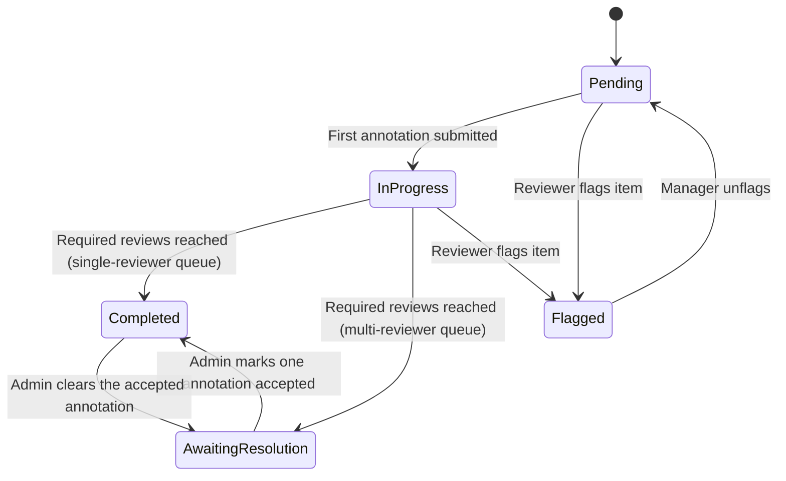

# Annotating

This page covers the reviewer workflow — how to work through an annotation queue, submit annotations, skip items, and flag items for follow-up.

## Accessing Your Queues

Navigate to **Annotation Queues** in the sidebar. You will see all queues you are assigned to (or all team queues, if you have queue management permissions).

!!! note "Annotation Reviewer role"
    If you have the **Annotation Reviewer** role, you will only see queues you are directly assigned to, and the navigation will be simplified to show only annotation-related pages.

## Starting Annotation

From the queue detail page, click **Start Annotating**. This begins a sequential review session — items are presented one at a time, oldest first.

The annotation UI has two panels:

- **Left panel** — the item content (chat history, participant data, session state)
- **Right panel** — the annotation form with the queue's schema fields

For session items, the left panel shows:

- Full conversation history with role indicators (human/assistant), message content, and timestamps
- **Participant Data** tab — any data stored against the participant
- **Session State** tab — the session's current state variables

## Submitting an Annotation

Fill in the annotation form fields and click **Submit**. Each reviewer can submit only one annotation per item.

After submission, the next item is loaded automatically.

!!! tip "Progress indicator"
    The annotation page shows your personal progress (items you've reviewed vs. total items in the queue).

## Editing Your Annotation

If you need to revise an annotation you've already submitted, open the item from the queue and click **Edit** next to your annotation in the annotations list. The annotation form opens pre-filled with your existing responses — make your changes and click **Save**, or **Cancel** to discard them. Saving updates the annotation in place and recomputes the queue's aggregate stats.

You can only edit your own annotations; annotations submitted by other reviewers remain read-only.

## Skipping an Item

If you want to come back to an item later, click **Skip**. The item will remain in the queue and you'll be shown the next one. Skipped items will appear again when you've gone through all other available items.

## Flagging an Item

If an item has an issue that prevents annotation — for example, missing content, a corrupted session, or content that needs admin review — use **Flag** and provide a reason.

| Aspect | Detail |
|--------|--------|
| **Effect** | Item status changes to **Flagged** |
| **Reason** | Required — explain why you flagged it |
| **History** | Flag reasons are recorded with the reviewer's name and timestamp (append-only) |
| **Unflagging** | Queue managers can unflag an item to return it to the review workflow |

!!! note
    Flagged items are excluded from the annotation workflow — they won't appear in the normal annotation sequence until unflagged by a manager.

## Item Status Lifecycle

| Status | Meaning |
|--------|---------|
| **Pending** | No annotations yet |
| **In Progress** | At least one annotation submitted, but not yet at the required count |
| **Awaiting resolution** | Multi-reviewer item has all required reviews, but no annotation has been marked **accepted** yet |
| **Completed** | Required number of reviews have been submitted (and, for multi-reviewer queues, an accepted annotation has been selected) |
| **Flagged** | Marked for follow-up; excluded from annotation workflow |

!!! note "Single vs multi-reviewer queues"
    On single-reviewer queues (the default, **Reviews required = 1**), the first submitted annotation is automatically marked as accepted and the item moves straight to **Completed**. The accepted workflow below only applies to queues configured with **Reviews required > 1**.

## Resolving Multi-Reviewer Conflicts

When a multi-reviewer queue collects all required reviews for an item, the item enters **Awaiting resolution** until a queue admin picks one annotation as the accepted answer.

On the annotate-item page, queue admins see:

- An amber **Awaiting resolution** banner at the top of the page
- A **Mark accepted** button next to each annotation in the annotations list

Clicking **Mark accepted** on an annotation flips the item to **Completed** and shows an **Accepted** badge on that row (with a tooltip recording who marked it and when). Selecting a different annotation moves the badge — only one annotation per item can be marked accepted at a time. Use **Clear accepted** to return the item to **Awaiting resolution**.

!!! tip "Why this matters"
    Aggregate scores prefer the accepted annotation when one is set; only when no annotation is accepted do they fall back to averaging across all submitted annotations. Marking an accepted answer therefore both resolves the conflict for the queue admin and ensures the queue's aggregate stats reflect the agreed answer.

## Read-Only View

When you open an item you've already annotated, the item content and the annotations list are shown without the submission form — each reviewer can only submit one annotation per item, but you can revise your own via the **Edit** action (see [Editing Your Annotation](#editing-your-annotation)).

If you don't have annotation permissions, the item is fully read-only: you can see the content and any existing annotations, but cannot submit or edit.
