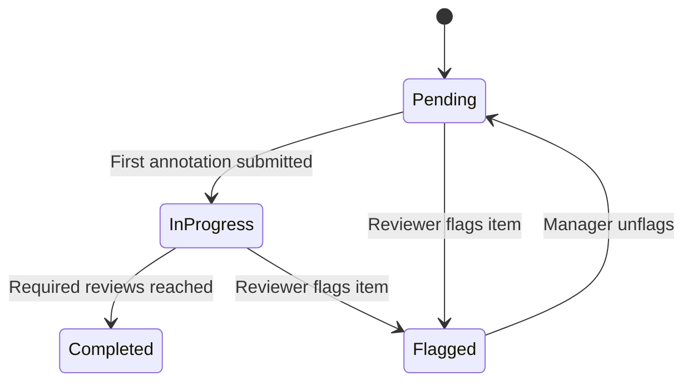

# Annotating

This page covers the reviewer workflow — how to work through an annotation queue, submit annotations, skip items, and flag items for follow-up.

## Accessing Your Queues

Navigate to **Annotation Queues** in the sidebar. You will see all queues you are assigned to (or all team queues, if you have queue management permissions).

!!! note "Annotation Reviewer role"
    If you have the **Annotation Reviewer** role, you will only see queues you are directly assigned to, and the navigation will be simplified to show only annotation-related pages.

## Starting Annotation

From the queue detail page, click **Start Annotating**. This begins a sequential review session — items are presented one at a time, oldest first.

The annotation UI has two panels:

- **Left panel** — the item content (chat history, participant data, session state)
- **Right panel** — the annotation form with the queue's schema fields

For session items, the left panel shows:

- Full conversation history with role indicators (human/assistant), message content, and timestamps
- **Participant Data** tab — any data stored against the participant
- **Session State** tab — the session's current state variables
- A **View Session** button next to the participant info, which opens the full chatbot session view for additional context

## Submitting an Annotation

Fill in the annotation form fields and click **Submit**. Each reviewer can submit only one annotation per item — you cannot edit a submitted annotation.

After submission, the next item is loaded automatically.

!!! tip "Progress indicator"
    The annotation page shows your personal progress (items you've reviewed vs. total items in the queue).

## Skipping an Item

If you want to come back to an item later, click **Skip**. The item will remain in the queue and you'll be shown the next one. Skipped items will appear again when you've gone through all other available items.

## Flagging an Item

If an item has an issue that prevents annotation — for example, missing content, a corrupted session, or content that needs admin review — use **Flag** and provide a reason.

| Aspect | Detail |
|--------|--------|
| **Effect** | Item status changes to **Flagged** |
| **Reason** | Required — explain why you flagged it |
| **History** | Flag reasons are recorded with the reviewer's name and timestamp (append-only) |
| **Unflagging** | Queue managers can unflag an item to return it to the review workflow |

!!! note
    Flagged items are excluded from the annotation workflow — they won't appear in the normal annotation sequence until unflagged by a manager.

## Item Status Lifecycle

| Status | Meaning |
|--------|---------|
| **Pending** | No annotations yet |
| **In Progress** | At least one annotation submitted, but not yet at the required count |
| **Completed** | Required number of reviews have been submitted |
| **Flagged** | Marked for follow-up; excluded from annotation workflow |

## Read-Only View

If you open an item that you've already annotated, or if you don't have annotation permissions, the item is shown in a **read-only view** — you can see the content and any existing annotations, but cannot submit a new one.
