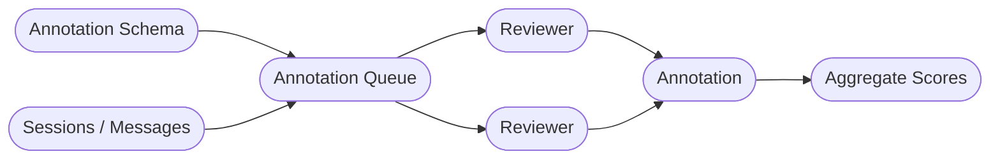

# Annotations

**Annotations** is a human review system for labeling and evaluating experiment sessions and messages. It enables teams to systematically collect structured feedback from reviewers — useful for data quality assessment, content moderation, chatbot evaluation, and training dataset creation.

## Overview

The annotations system is built around **queues** — organized collections of items that reviewers work through sequentially. Each queue defines a custom set of fields (the schema) that reviewers fill in for every item.

### Key Components

**[Annotation Queue](queues.md)**
: The central object. Contains items to be reviewed, defines the annotation schema, manages assignees, and tracks progress.

**Annotation Schema**
: The set of fields reviewers fill in. Defined per queue. Supports integer, float, string, and choice (enum) field types.

**Annotation Items**
: Individual sessions added to a queue. Each item moves through a lifecycle: Pending → In Progress → Completed (or Flagged).

**Annotations**
: A single reviewer's submitted responses for one item. Each reviewer can annotate each item only once.

## Use Cases

- **Quality assurance** — have reviewers rate conversation quality on a defined scale
- **Content moderation** — flag problematic sessions and categorize issues
- **Chatbot evaluation** — collect human judgments alongside automated [evaluations](../evaluations/index.md)
- **Dataset labeling** — annotate sessions for downstream model training or fine-tuning
- **Inter-rater reliability** — configure multiple reviews per item to measure reviewer agreement

## Roles

| Role | Capabilities |
|------|-------------|
| Team Admin / Member (with queue permissions) | Create and manage queues, add sessions, export results, manage assignees, view aggregates |
| **Annotation Reviewer** | View and annotate queues they are assigned to only. Cannot manage queues, export, or access other app areas. |

!!! note "Annotation Reviewer role"
    The **Annotation Reviewer** role is designed for external annotators or team members who should only have access to their assigned annotation work — they won't see other parts of the application.

## Getting Started

1. [Create an annotation queue](queues.md#creating-a-queue) with a schema and assignees
2. [Add sessions](queues.md#adding-items) to the queue
3. Assignees [work through items](annotating.md) and submit annotations
4. Review progress and [export results](queues.md#exporting-results)
