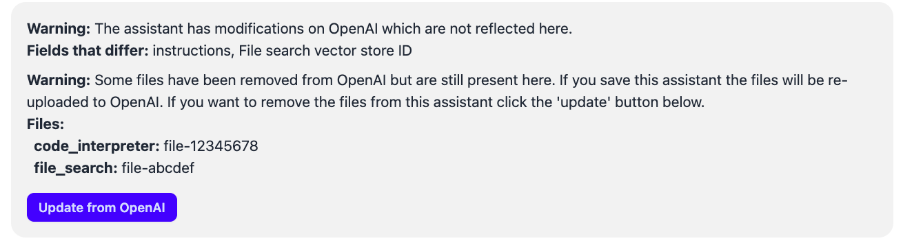

# OpenAI Assistants

!!! warning "Deprecation Warning"

    OpenAI has [deprecated](https://platform.openai.com/docs/deprecations#2025-08-20-assistants-api) Assistants and will completely remove support on 2026-08-26.

    Open Chat Studio supports all the features of Assistants in other ways. To find out about migrating away from Assistants see the [migration guide](../how-to/assistants_migration.md).

## Syncing with OpenAI
The in-sync status with OpenAI is automatically checked each time a user visits the edit screen of an assistant. If the assistant in OCS has the identical configurations and files with the assistant in OpenAI, then an in-sync status will appear under the assistant id:

Otherwise, a warning will be displayed explaining what is out of sync. For example, in the image below, there are files uploaded in OpenAI that are not uploaded in OCS. This may result in unexpected behavior from the assistant. To resolve, upload the listed files in the edit screen.

!!! warning "Assistants in versioned chatbots"

    Although an assistant cannot be modified in OCS once a chatbot version that references it is released, it can still be modified in OpenAI. A new assistant in OpenAI is created at release time, and *we recommend not modifying that assistant to preserve expected behavior in the released chatbot*.

## Archiving

* **Goal: Archiving an assistant in OCS deletes the associated assistant in OpenAI.** This is an easy way to stop incurring costs and ensure that the assistant is closed for all chatbots and pipelines that reference it within a project.
- OCS first checks whether any published or unreleased chatbots and pipelines reference the assistant. If they do, archival is blocked and a modal lists the blocking chatbots and pipelines. If only released versions reference the assistant, they are archived automatically.
- If any published or unreleased chatbots reference the assistant, they are listed under the *"Chatbots"* section of the modal. For published chatbots, navigate to those versions and archive them. For unreleased versions, navigate to the version and either (1) remove the assistant reference or (2) archive the chatbot.
- If a pipeline references an assistant but is not referenced by any chatbot, that pipeline must be archived. These pipelines appear under the *"Pipelines"* section of the modal. Navigate to the pipeline and either archive it or remove the assistant reference to unblock assistant archival.
- If a pipeline references an assistant and that pipeline is used by a published chatbot, you must archive the chatbot. These items are listed under the *"Chatbots Referencing Pipeline"* section of the modal. The links take you to the relevant chatbot versions to archive.

!!! info "Archiving an assistant with versions"
    If the assistant you are trying to archive has versions, the same checks apply to all versions of the assistant and are displayed together in the modal. Once confirmed, all assistant versions will be archived.
