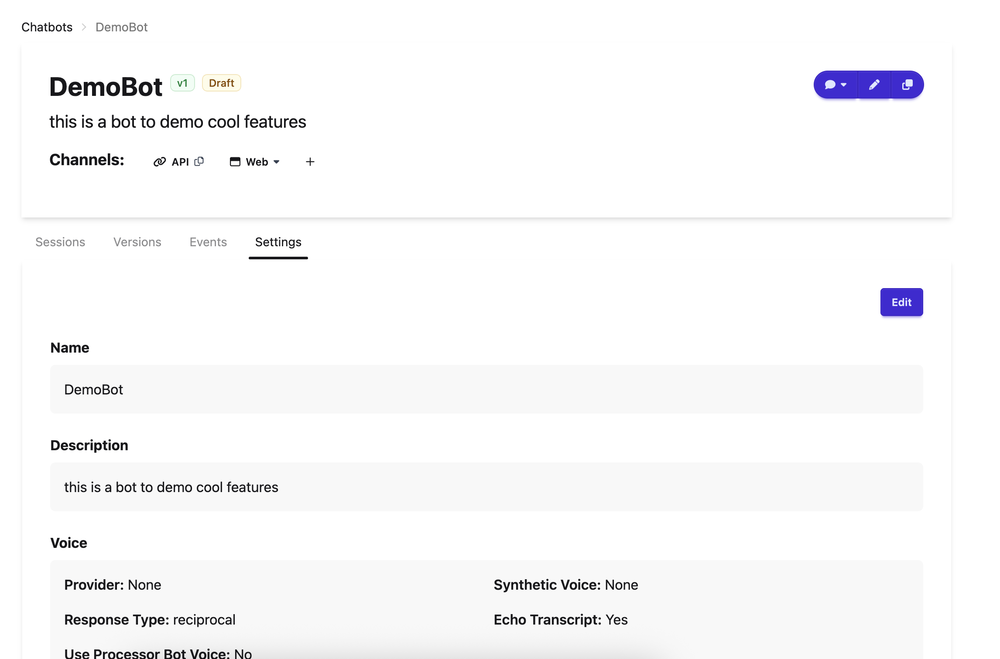
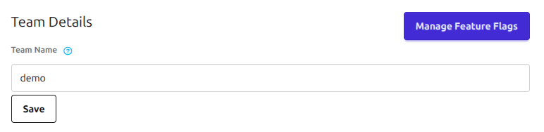
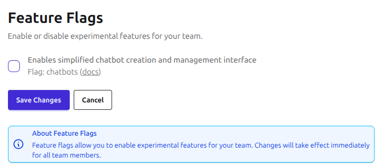

# Frequently Asked Questions

### Are my existing Experiments going to be lost after the upgrade from Experiments to Chatbots?
No! This update is solely in the bot building experience and not in the end product the user sees. All existing experiments will be seamlessly transferred over to Chatbots without change in any of the chatbot functionality.

### What do I have to do during the Experiments to Chatbots transition?
Nothing! All of your experiments will be transferred over to use chatbots automatically. You will receive updates on the progress of the transition via banners on the site.

### How do I adjust the global settings of my chatbot?
Different from an Experiment, the settings have been moved to a tab on the Chatbot homepage.
<figure markdown="span">
  
  <figcaption>The settings tab</figcaption>
</figure>
Here, you are able to modify name, description, voice, tracing, consent, surveys, participant allowlist, and seed message.

### How can I control feature rollouts for my team?
Team administrators can manage the chatbot feature for their team.

To access feature flag management:

1. Navigate to your team's settings page
2. Click on the "Manage Feature Flags" button

<figure markdown="span">
  
  <figcaption>Feature Flag Management</figcaption>
</figure>

<figure markdown="span">
  
  <figcaption>Feature Flag Management Page</figcaption>
</figure>
