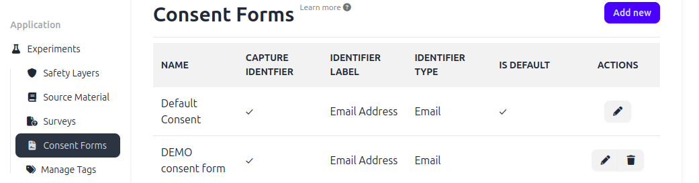
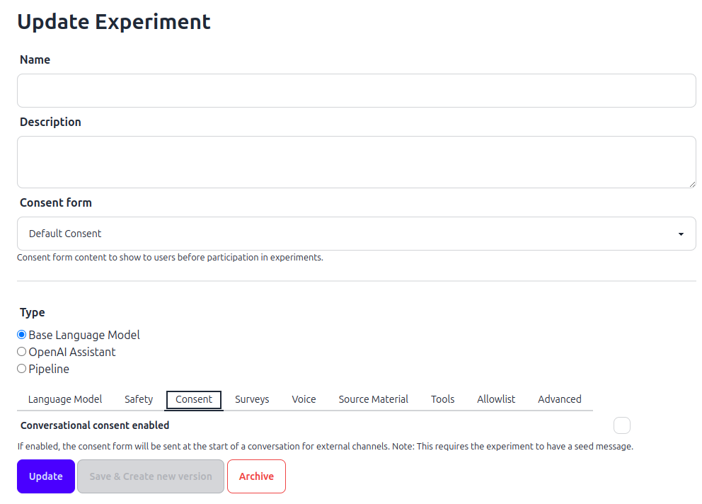

# Consent Forms

_This page provides an overview for how to create and deploy a consent form for your chatbot._

## Understanding Consent Forms

Consent forms allow chatbot makers to provide context to chatbot users on how their data will be used, and who to contact about any
concerns. Currently, consent forms can only be viewed by users when accessing an OCS chatbot via the web link (example image given
below).

**Note:** If you create a chatbot experiment, add a consent form and deploy the bot on WhatsApp or Telegram, users will not be able to see the
form or provide consent- they will be able to access the bot directly. If you deploy your OCS chatbot on WhatsApp or Telegram but would still
like to capture consent, you can incorporate consent language in your chatbot prompt, and instruct the bot to first collect consent from the
user before proceeding with the interaction.

## Create a Consent Form

To create a consent form, navigate to the "Consent Forms" option on the left-hand menu. Follow the steps given below.

1. **Select "Add New".**
2. **Name:** This is a name for you / your team members on OCS to identify between different consent forms you may create. Note that the
    users of your chatbot will not be able to see this name.
3. **Consent text:** Here, you can add in any text of your choosing. This text may be in any language. Dimagi often incorporates the
    following elements in each consent form:
       That we do not guarantee the accuracy of chatbot responses.
       How we might use data from chatbot interactions.
       An email address and phone number for the relevant Dimagi team running the experiment.
       A set of bullets asking the user to confirm that they have read the context above, that they are over 18 years of age and that they
       have voluntarily agreed to try out the chatbot.
4. **Capture Identifier:** By selecting this box, you will create a consent form in which a chatbot user is asked to provide some kind of
    identifier as they provide consent. There are a variety of identifiers you can select, for example email address, phone number, name or
    initials.
5. **Identifier Label:** Based on your choice of identifier, in this field you can write down the text you would like a user to see on the consent
    form, when collecting their information. This text can be in any language. For example:
       "Please provide your email address"
       Or "Email address"
       Or "Please type your name or any identifier you choose".
6. **Identifier Type:** There are two options you can select: email or text, based on your choice of identifier in steps 4 and 5 (above).
    Selecting the "Email" option results in a consent form that doesn't allow the user to proceed until they have provided a full email address.
    Selecting the "Text" option allows users to write letters or numbers, as per your instructions in the Identifier Label.
7. **Click "Create".** Now you have a consent form! When you navigate to the Consent Forms landing page, you will be able to see that
    version, as well as any other forms you or your team members have created.

## Final Step

When creating your chatbot, be sure to select your choice of consent form from the drop down menu. (Note that the menu will not be
populated unless you or your team members on OCS have created forms).

