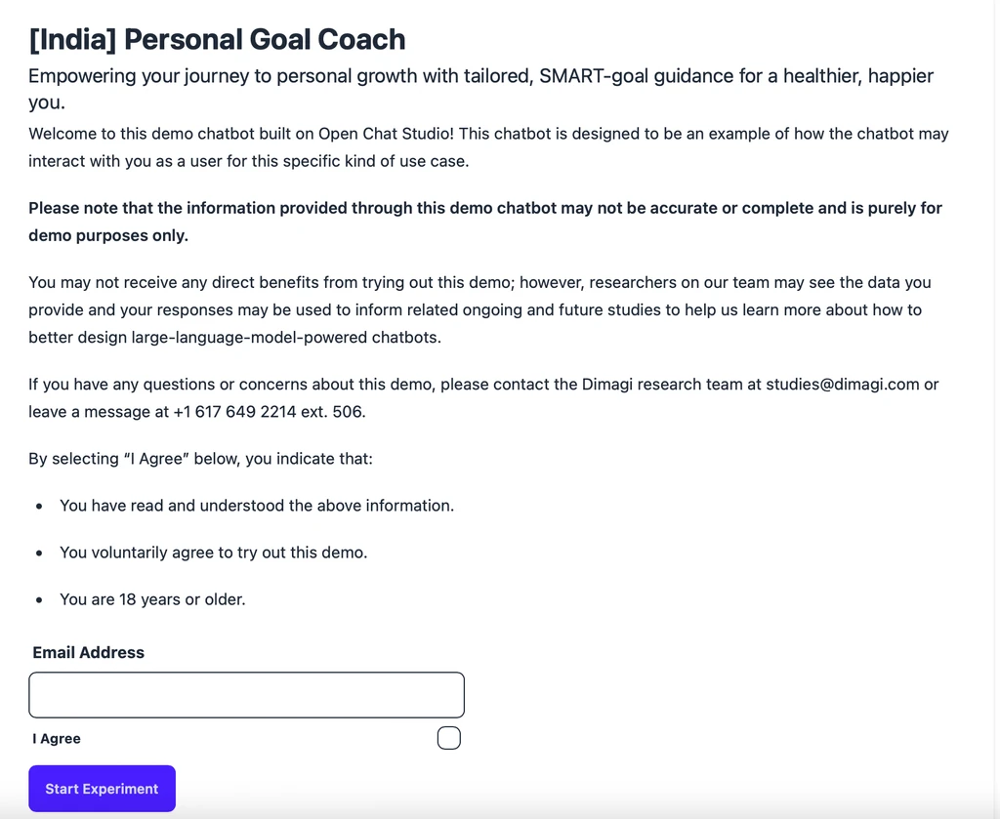

# Consent Forms

Consent forms allow chatbot makers to provide context to chatbot participants on how their data will be used, and who to contact regarding any concerns. Consent forms are displayed to participants before they start interacting with the chatbot.

!!! info "Using consent forms on WhatsApp, Telegram and other channels"
    If you are deploying your chatbot on WhatsApp, Telegram or any channels other than the Web channel, you can still include consent forms in your chatbot by enabling the 'Conversational Consent' option for the chatbot.

A default consent form is created for each team. You can customize this default form or create new forms by navigating to the "Consent Forms" section of Open Chat Studio.

## Consent forms and published versions

When you [publish a version](versioning.md) of your chatbot, the wording of its consent form at that moment is kept with that version. Editing your working consent form afterwards does not change what already-published versions show — participants always see the wording that belongs to the version they are chatting with.

To put revised wording in front of participants, edit the consent form and then publish a new version. Participants who consented to the old wording are asked to consent again.

!!! note
    Versions published before September 2026 do not have their own copy of the consent form and continue to follow the working form until you publish the chatbot again.

## What to put in a consent form

Some common elements you may want to include in a consent form are:

* A disclaimer stating that the accuracy of chatbot responses is not guaranteed.
* How you might use data from chatbot interactions.
* An email address and phone number for the relevant team responsible for managing the chatbot.
