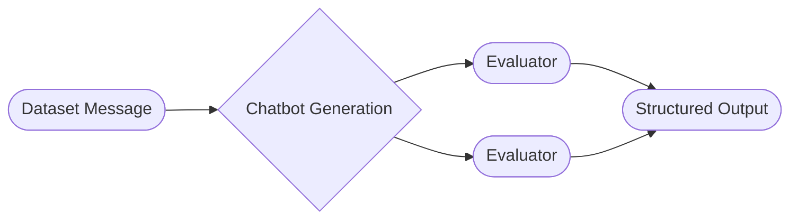

# Evaluations

**Evaluations** is a testing system for measuring chatbot performance against different metrics.

Evaluations can be run against existing conversation messages in the system or uploaded custom test datasets. Metrics can be defined either as python code, or output from an LLM.

## Overview

**Evaluations** are made up of a [dataset](./dataset.md) and one or more [evaluators](./evaluators.md).

### Dataset

**Datasets** are collections of messages that serve as the foundation for running evaluations.

Datasets can either be created directly from existing [sessions](../sessions.md), manually created in the UI, or uploaded with a CSV.

### Evaluator

**Evaluators** define the logic for analyzing messages and generating evaluation metrics. Each evaluator takes individual messages from a dataset and optionally a generated response, then outputs structured results in a table. You can apply many evaluators to a dataset in parallel, and the outputs of each will be added as new columns to the table.

### Chatbot Generation

Messages can also optionally be passed in to a [chatbot](../chatbots/index.md), whose generation output will be available to the evaluators.

## Evaluation Execution

When an evaluation is run, each message from the dataset is first passed in to the defined chatbot (if applicaple). The result, with the added generation output is then passed in to each evaluator in parallel. The evaluators output structured data. This data is compiled into a table, whose rows are each message and the columns are the evaluator output.

## Session Retention

When evaluations are run with chatbot generation enabled, temporary sessions are created to store the generated responses and conversation context. These evaluation sessions are automatically deleted after **30 days**.

!!! warning "Data Retention"
    Session deletion is permanent and cannot be undone. Ensure you export any evaluation results you need to retain before the 30-day retention period expires.

!!! note "Source Sessions Unaffected"
    This automatic deletion only affects sessions created during evaluation runs. Source sessions (the original sessions that datasets may be cloned from) are not affected by this retention policy and remain in the system according to their own lifecycle.
