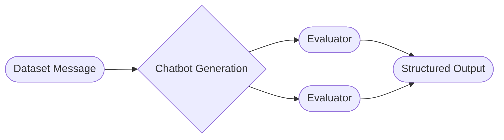

# Evaluations

Building a chatbot is the easy part. Knowing if it's actually working well — especially as you tweak prompts, swap models, or add new features — is harder. **Evaluations** let you check this systematically: run your chatbot against a set of sample conversations, and automatically score the results against criteria you define, such as accuracy, tone, or whether it stayed on topic.

Running evaluations regularly gives you an early warning when a change makes responses worse, and proof when a change makes them better — instead of relying on spot-checking conversations by hand.

In Open Chat Studio, evaluations can be run against existing conversation messages already in the system, or against a custom set of test cases you upload.

## Overview

- **Evaluations** are made up of a [dataset](./dataset.md) and one or more [evaluators](./evaluators.md).
- **Datasets** are collections of test case messages that serve as the foundation for running evaluations. Datasets can either be created directly from existing [sessions](../sessions.md), manually created in the UI, or uploaded with a CSV. They are inputs for an evaluation.
- **Evaluators** define the logic for analyzing messages and generating evaluation metrics, either as an [LLM-as-judge prompt](./evaluators.md#llm-evaluator) or [custom python code](./evaluators.md#python-evaluator). Each evaluator takes individual messages from a dataset and optionally a generated response, then outputs structured results in a table. You can apply many evaluators to a dataset in parallel, and the outputs of each will be added as new columns to the table.
- **[Tag Rules](./tag_rules.md)** automatically tag sessions or messages whose evaluator output meets a condition you define, such as a low confidence score or negative sentiment, so you can jump straight to the conversations that need attention.

## Evaluation Execution

When an evaluation is run, each message from the dataset is first passed in to the defined chatbot (if applicable). The result, with the added generation output is then passed in to each evaluator in parallel. The evaluators output structured data. This data is compiled into a table, whose rows are each message and the columns are the evaluator output.

```mermaid
flowchart LR
    dataset([Dataset Message]) --> generation{Chatbot Generation}
    generation --> evaluator1([Evaluator])
    generation --> evaluator2([Evaluator])
    evaluator1 --> structured_output([Structured Output])
    evaluator2 --> structured_output
```

### Chatbot Generation

Messages can also optionally be passed in to a [chatbot](../chatbots/index.md), whose generation output will be available to the evaluators.

### Session Retention

When evaluations are run with chatbot generation enabled, temporary sessions are created to store the generated responses and conversation context. These evaluation sessions are automatically deleted after **30 days**.

!!! warning "Data Retention"
    Session deletion is permanent and cannot be undone. Ensure you export any evaluation results you need to retain before the 30-day retention period expires.

!!! note "Source Sessions Unaffected"
    This automatic deletion only affects sessions created during evaluation runs. Source sessions (the original sessions that datasets may be cloned from) are not affected by this retention policy and remain in the system according to their own lifecycle.
