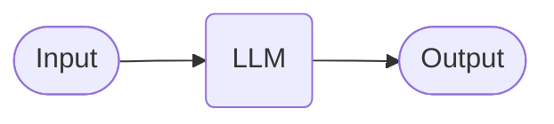
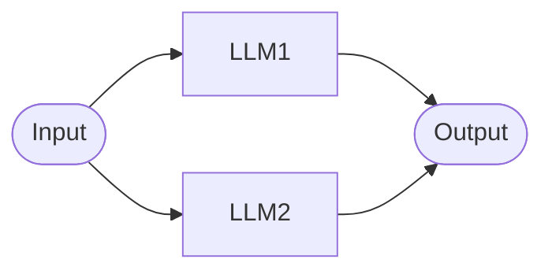
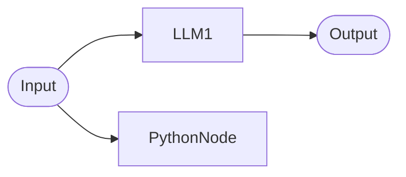
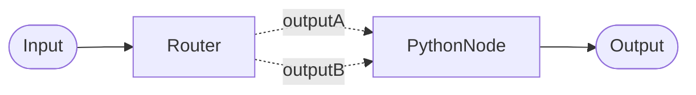
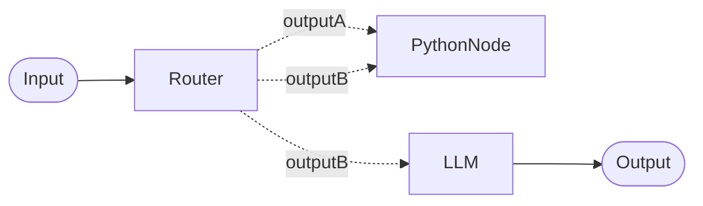

# Pipelines

A pipeline is a way to build a bot by combining one or more steps together.

!!! info "Pipelines are the future"

    Pipelines are currently becoming the default way to build bots in Open Chat Studio. They are a superset of existing functionality, enabling complex safety layers, routing and conditionals. The transition is now underway, and we're providing communication as we begin phasing out other bot building approaches.

## Overview

Here is an example of a very simple pipeline that uses an LLM to respond to the users input. This pipeline has a
single step that uses the LLM to generate a response.

<figure markdown="span">
  
  <figcaption>A simple pipeline</figcaption>
</figure>

Analyzing this pipeline from left to right:

* the user sends a message to the bot (this is the `input`)
* the message is then passed to the LLM which generates a response
* the response is then sent back to the user (this is the `output`)

Each time a user sends a message to the bot, the pipeline is executed and the final output is sent back to the user.

Each 'step' in a pipeline is called a 'node' and pipelines can have multiple nodes. To learn more about the different
types of nodes that can be used in a pipeline, see the [node types](nodes.md) documentation.

## Pipeline Execution

Here's a simplified version for user-facing documentation:

**How LangGraph Executes Your Application**

Open Chat Studio  runs your application in organized steps. Think of it like a well-coordinated team where different parts of your application (pipeline **nodes**) communicate through shared **channels** (pipeline edges / connections).

Here's how each step works:

**Plan** → **Execute** → **Update** → Repeat

1. **Plan**: Decide which nodes should run next. Initially, this includes nodes that need your input data. In later steps, it includes nodes that are ready to process new information.

2. **Execute**: Run all selected nodes at the same time. Each node does its work independently and can't see changes from other nodes until the next step.

3. **Update**: Share the results from all nodes so they're available for the next step.

This process repeats until either all work is complete or a step limit is reached. This approach ensures your application runs efficiently while maintaining predictable behavior.

### Parallel Nodes
Nodes can run in parallel when they are not directly connected in sequence, allowing multiple operations to proceed simultaneously.

### Dangling nodes
Nodes without connected outputs (dangling nodes) are supported and will execute in turn. The outputs of these nodes will still be recorded in the pipeline state.

### Multiple outputs
Connecting multiple outputs from one node (e.g. a router node) to the output of another node is allowed. If more than one of the outputs from the node has a value, the first one will be passed to the next node as input.

Outputs can also be connected to multiple other nodes:

### Cycles

!!! warning
    Cycles in pipelines are not supported.

-   :material-hexagon-multiple-outline:{ .lg .middle } __More Example Workflows__

    ---

    [:octicons-arrow-right-24: Workflow Cookbook](../../how-to/workflow_cookbook.md)

