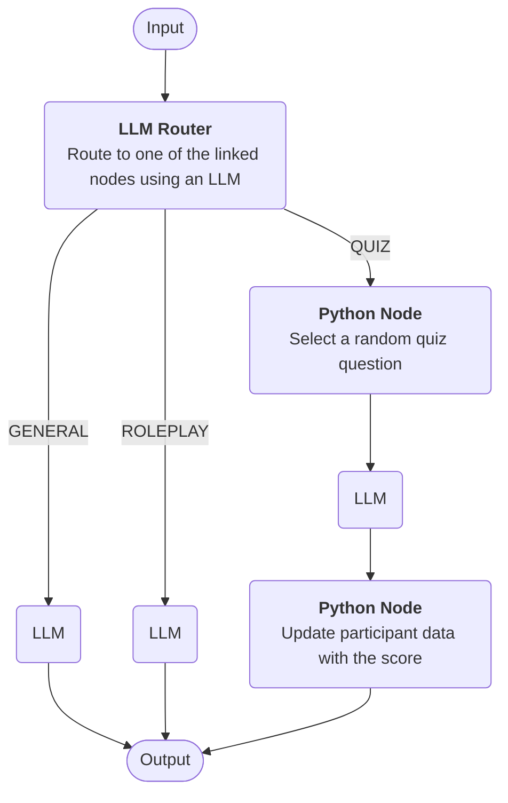

# Pipelines

A pipeline is a way to build a bot by combining one or more steps together. 

!!! info "Pipelines are the future"

    In future, pipelines will be the default way to build bots in Open Chat Studio. They are a superset of existing functionality, enabling complex safety layers, routing and conditionals. There will be ample communciation before we deprecate other bot building approaches. 

Here is an example of a very simple pipeline that uses an LLM to respond to the users input. This pipeline has a 
single step that uses the LLM to generate a response.

<figure markdown="span">
  
  <figcaption>A simple pipeline</figcaption>
</figure>

Analyzing this pipeline from left to right:

* the user sends a message to the bot (this is the `input`)
* the message is then passed to the LLM which generates a response
* the response is then sent back to the user (this is the `output`)

Each time a user sends a message to the bot, the pipeline is executed and the final output is sent back to the user.

Each 'step' in a pipeline is called a 'node' and pipelines can have multiple nodes. To learn more about the different
types of nodes that can be used in a pipeline, see the [node types](nodes.md) documentation.

## Advanced Example

Here is a more complex example that uses a [LLM Router](nodes.md#llm-router) to route the input to one of three linked nodes.
It also uses a [Python Node](nodes.md#python-node) to perform some custom logic.

