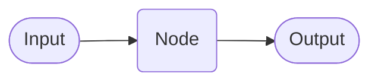

# Pipelines

A **pipeline** is a visual workflow in Open Chat Studio (OCS) that makes it easy to build chatbots that can perform multiple or complex tasks.

A chatbot pipeline is made up of connected **nodes** — each node performs one task, such as calling a Large Language Model (LLM), running custom logic, or routing the conversation to a different workflow path. A message enters the pipeline as **input**, passes through one or more nodes, and exits as the chatbot's **output** as a response to the user.

``` mermaid
graph LR
  A@{ shape: stadium, label: "Input" } --> B(Node);
  B --> C@{ shape: stadium, label: "Output" };
```
Every time a user sends a message, the pipeline workflow runs from start to finish and the final output is sent back to the user.

## A Simple Example

The OCS screenshot below shows a chatbot that has a single node in its pipeline. The user sends a message, the LLM node generates a reply, and that reply is sent back to the user. That's it.

<figure markdown="span">
  
  <figcaption>A simple pipeline</figcaption>
</figure>

Each step in a pipeline is called a **node**. Pipelines can have as many nodes as your workflow requires. See [Node Types](nodes.md) for a full list of what each node can do.

## How a Pipeline Runs

Open Chat Studio  runs your application in organized steps. Think of it like a well-coordinated team where different parts of your application (pipeline **nodes**) communicate through shared **channels** (pipeline edges / connections).

When a user sends a message, Open Chat Studio processes the chatbot pipeline in repeating cycles:

**Plan** → **Execute** → **Update** → Repeat

1. **Plan**: Identify which nodes are ready to run. On the first cycle, this is the node connected to the user's input. On later cycles, it is any node whose dependencies have been satisfied.

2. **Execute**: Run all ready nodes at the same time. Each node works independently — it cannot see the results of other nodes running in the same cycle.

3. **Update**: Share the results from all nodes so they're available for the next step.

This repeats until all nodes have completed or a maximum step limit is reached.

!!! tip "Running nodes in parallel"

    Because multiple nodes can execute in the same cycle, pipelines naturally support parallel processing. See [Parallel Pipelines](./parallel.md) for details.

## Asking the Assistant About a Pipeline

!!! tip "Chat widget context"

    When you are viewing a pipeline in Open Chat Studio, the in-app chat widget automatically receives the pipeline's structure (nodes and connections) and event trigger data as context. This means you can ask the assistant questions about the pipeline you are currently editing — for example, what a particular node does or how the flow is connected. The context updates automatically as you make changes to the pipeline.
