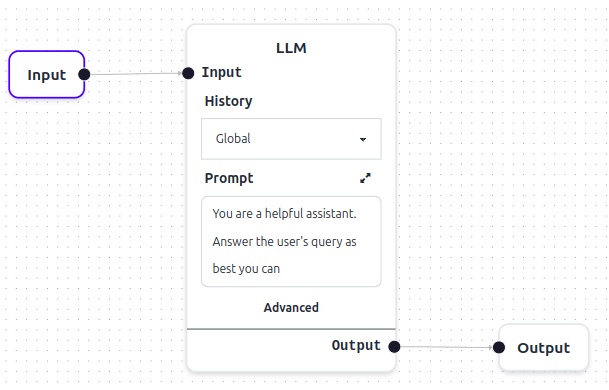

# Pipelines

## What is a Pipeline?

A **pipeline** is a visual workflow in Open Chat Studio that defines how a chatbot processes messages and generates responses. Think of it like a recipe or assembly line — each step in the pipeline does one specific job, and the steps are connected together to create a complete conversation flow.

### In Plain English

Imagine a customer service chatbot:

1. A customer sends a question
2. The chatbot receives the message (input)
3. It processes the message through a series of steps (the pipeline)
4. Finally, it sends back an answer (output)

## What is a Node?
Each step in the pipeline is called a **node**. A node performs one specific task, such as:

- Calling an AI model to generate a response ([LLM node](nodes.md#llm-node))
- Running custom logic or code ([Python node](nodes.md#python-node))
- Making decisions about which way the conversation should go ([Router nodes](nodes.md#routing-nodes))
- Sending emails or extracting data (specialty nodes)

Pipelines are **visual** — you build them by dragging nodes onto a canvas and connecting them with lines, making it easy to see and understand your chatbot's logic without writing complex code.

## A Simple Example

Here's the simplest possible chatbot pipeline — it has just **one node**:

<figure markdown="span">
  
  <figcaption>A simple pipeline</figcaption>
</figure>

In this simple pipeline:

1. A user sends a message
2. The [LLM node](nodes.md#llm-node) receives the message and uses AI to generate a response
3. The response is sent back to the user

That's the complete conversation flow! Every time the user sends a message, the pipeline runs through all its steps (in this case, just one) and returns the output.

## Complex Pipelines

Most real-world chatbots are more complex than a single node. Pipelines become powerful when you combine multiple types of nodes to handle different tasks.

By breaking tasks into separate nodes, you can:

- Keep logic focused and easy to understand
- Reuse nodes across different parts of your pipeline
- Test and modify individual steps without affecting the whole pipeline
- Scale complex workflows without overwhelming a single AI prompt

### Node Types for Complex Pipelines

Here are the main node types you can use to build more sophisticated chatbots:

 - **[LLM Node](nodes.md#llm-node)** — Processes messages using an AI model. Handles natural conversations, answering questions, and generating responses.

 - **[Routing Nodes](nodes.md#routing-nodes)** — Makes decisions about which path the conversation should take based on the message content. Useful for directing different types of questions to different handling logic, or routing based on user intent.

 - **[Python Node](nodes.md#python-node)** — Runs custom code to handle complex logic, fetch data from external systems, process attachments, or manipulate participant data.

 - **[Render Template Node](nodes.md#render-a-template-node)** — Formats responses using templates, allowing you to customize messages with dynamic data.

 - **[Send Email Node](nodes.md#send-an-email-node)** — Sends emails as part of your pipeline, useful for notifications or confirmations.

 - **[Extract Structured Data Node](nodes.md#extract-structured-data-node)** — Pulls specific information from conversations and structures it for downstream processing.

 - **[Update Participant Data Node](nodes.md#update-participant-data-node)** — Saves information about the user for later use in the conversation.

## How a Pipeline Runs

Open Chat Studio (OCS) executes your pipeline in organized steps, running nodes in parallel when possible. Think of it like a well-coordinated team where different pipeline **nodes** work together, each completing their task and passing results forward.

When a user sends a message, OCS processes the chatbot pipeline in repeating passes:

**Plan** → **Execute** → **Update** → Repeat

1. **Plan**: Identify which nodes are ready to run. On the first pass, this is the node(s) directly connected to the user's input. On later passes, any node whose dependencies have been satisfied is ready.

2. **Execute**: Run all ready nodes in parallel. Each node processes independently — it cannot see the results of other nodes running in the same pass.

3. **Update**: Share the results from all nodes so they're available for the next step.

This repeats until all nodes have completed or a maximum step limit is reached.

!!! tip "Running nodes in parallel"

  Because multiple nodes can execute in the same pass, pipelines naturally support parallel processing. See [Parallel Pipelines](./parallel.md) for details.

## Asking the Assistant About a Pipeline

!!! tip "Chat widget context"

    When you are viewing a pipeline in OCS, the in-app chat widget automatically receives the pipeline's structure (nodes and connections) and event trigger data as context. This means you can ask the assistant questions about the pipeline you are currently editing — for example, what a particular node does or how the flow is connected. The context updates automatically as you make changes to the pipeline.
