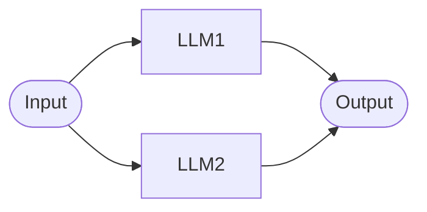
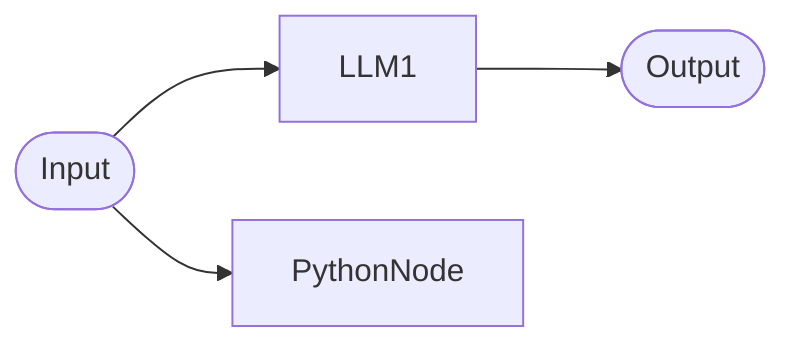
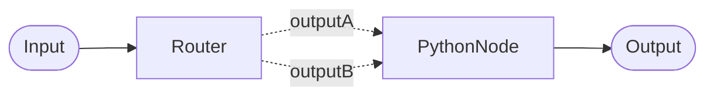
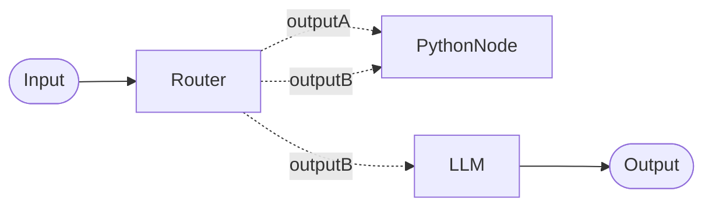
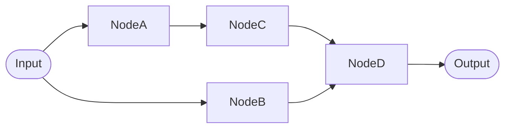
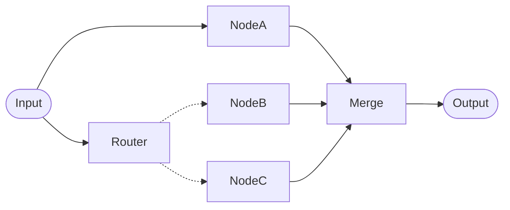

# Parallel Pipelines
Nodes in a pipeline can run in parallel, allowing multiple operations to proceed simultaneously.


```mermaid
flowchart LR
    start([Input]) --> LLM1 & LLM2
    LLM1 --> out([Output])
    LLM2 --> out
```

!!! warning "Limitations"
    **Cycles**

    Configurations that result in cycles (recursive loops) are not supported.

    **Multiple Exectuion**

    In cases where the branches of a workflow do not have the same number of nodes and then merge, nodes after the merge will be executed more than once without special handling. See the section below on [Uneven Banches](#uneven-branches)

## Dangling nodes
Nodes without connected outputs (dangling nodes) are supported and will execute in turn. The outputs of these nodes will still be recorded in the pipeline state.


```mermaid
flowchart LR
    start([Input]) --> LLM1 & PythonNode
    LLM1 --> out([Output])
    PythonNode
```

See this pattern used in the Workflow Cookbook: [Safety check in parallel](../../how-to/workflow_cookbook.md#safety-check-in-parallel), where an unconnected **safe** output lets compliant messages pass through unchanged.

## Multiple outputs
Connecting multiple outputs from one node (e.g. a router node) to the output of another node is allowed. If the node produces more than one output over the course of the run, the most recent one is passed on as input — see [Which input a node receives](#which-input-a-node-receives).


```mermaid
flowchart LR
    start([Input]) --> Router
    Router -.outputA.-> PythonNode
    Router -.outputB.-> PythonNode
    PythonNode --> out([Output])
```

Outputs can also be connected to multiple other nodes:


```mermaid
flowchart LR
    start([Input]) --> Router
    Router -.outputA.-> PythonNode
    Router -.outputB.-> PythonNode
    Router -.outputB.-> LLM
    LLM --> out([Output])
```

See this pattern used in the Workflow Cookbook: [Router for classification](../../how-to/workflow_cookbook.md#router-for-classification), where multiple category outputs feed into the same Python node.

## Which input a node receives

A node runs once for every time an upstream branch reaches it. Each run has:

* **`input`** — the output that arrived most recently, i.e. from the branch that triggered this run.
* **`node_inputs`** — every output that has arrived so far, oldest first. On a node where branches merge this list grows with each run, which is how a node sees more than one branch at once.

Inputs are ordered by when they arrived, never by the order the connections were drawn, so redrawing the same graph does not change what a node receives.

!!! note "Reading the other branches"

    `node_inputs` is available to the [Python node](../../tech-hub/python_node.md#additional-keyword-arguments) as a keyword argument, and to the template and email nodes as `{{ node_inputs }}`. A Python node can also read any completed node by name with `get_node_output("Node Name")`, which is the clearest option when you know which branches you are merging.

## Uneven branches

Consider the following graph:


```mermaid
flowchart LR
    start([Input]) --> NodeA
    start --> NodeB
    NodeA --> NodeC
    NodeC --> NodeD
    NodeB --> NodeD
    NodeD --> out([Output])
```

The execution steps are as follows:

1. `NodeA` and `NodeB` in parallel
2. `NodeC` and `NodeD` in parallel
3. `NodeD`

Notice how `NodeD` gets executed twice. The first time it runs, only `NodeB` has reached it, so `NodeB`'s output is its `input` and its single `node_inputs` entry. By the second run `NodeC` has finished, so `NodeC`'s output becomes the `input` and `node_inputs` holds both.

To understand why this happens you need to understand the [execution model](index.md#how-a-pipeline-runs).

You can manage this challenge by using a `PythonNode` with some utility functions:

* `require_node_outputs`: This function will abort any node run if all the requested data is not available.
* `wait_for_next_input`: This is a lower level function that can be used when `require_node_outputs` isn't suitable.

In the example above, we could use the following code in `NodeD` to merge the outputs:

```python
def main(input, **kwargs):
    # this will abort the first run since only `NodeB` has outputs
    require_node_outputs("NodeB", "NodeC")
    b = get_node_output("NodeB")
    c = get_node_output("NodeC")
    return f"{b}\n{c}"
```

Using the lower level `wait_for_next_input` function we can do the same thing:

```python
def main(input, **kwargs):
    b = get_node_output("NodeB")
    c = get_node_output("NodeC")
    if b is None and c is None:
        # abort until both are available
        wait_for_next_input()
    return f"{b}\n{c}"
```

## Optional Parallel Branches

This shows a use case for the `wait_for_next_input` function. We have a pipeline which has parallel branches and a merge node but not all the branches will execute.


```mermaid
flowchart LR
    start([Input]) --> Router
    start --> NodeA
    Router -.-> NodeB
    Router -.-> NodeC
    NodeA --> Merge
    NodeB --> Merge
    NodeC --> Merge
    Merge --> out([Output])
```

The `Merge` node will get outputs from `NodeA` and either `NodeB` or `NodeC`. We can't use `require_node_outputs` because not all outputs will be generated. Instead we need to use the `wait_for_next_input` function:

=== "Option 1"

    ```python
    def main(input, **kwargs):
        b = get_node_output("NodeB")
        c = get_node_output("NodeC")
        b_or_c = b or c
        if not b_or_c:
            # wait until we have either b or c
            wait_for_next_input()
        a = get_node_output("NodeA")
        return f"{a}\n{b_or_c}"
    ```

    Note that we don't need to check if we have output from `NodeA` since it will be guaranteed to be available by the time `NodeB` or `NodeC` execute due to the execution order.

=== "Option 2"

    This option makes use of the [`node_inputs`](../../tech-hub/python_node.md#additional-keyword-arguments) keyword argument which contains a list of all the inputs available to the current node execution. Since we want to wait until we have inputs from `NodeA and (NodeB or NodeC)` we can check that the inputs list has at least two values.

    ```python
    def main(input, **kwargs):
        all_inputs = kwargs.get("node_inputs", [])
        if len(all_inputs) < 2:
            # wait until we have at least two inputs
            wait_for_next_input()
        return "\n".join(all_inputs)
    ```

<div class="grid cards" markdown>

-   :material-hexagon-multiple-outline:{ .lg .middle } __More Example Workflows__

    ---

    [:octicons-arrow-right-24: Workflow Cookbook](../../how-to/workflow_cookbook.md)

</div>
