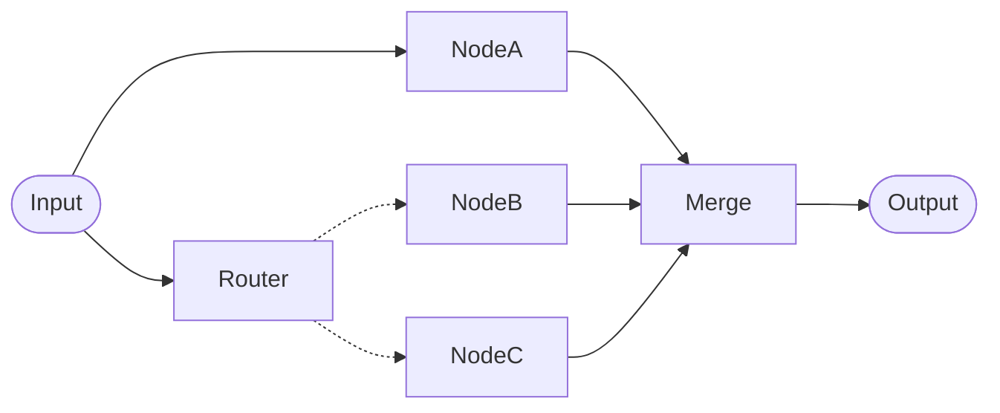

# Parallel Pipelines
Nodes in a pipeline can run in parallel, allowing multiple operations to proceed simultaneously.


!!! warning "Limitations"
    **Cycles**
    
    Configurations that result in cycles (recursive loops) are not supported.

    **Multiple Exectuion**
    
    In cases where the branches of a workflow do not have the same number of nodes and then merge, nodes after the merge will be executed more than once without special handling. See the section below on [Uneven Banches](#uneven-branches)

## Dangling nodes
Nodes without connected outputs (dangling nodes) are supported and will execute in turn. The outputs of these nodes will still be recorded in the pipeline state.


## Multiple outputs
Connecting multiple outputs from one node (e.g. a router node) to the output of another node is allowed. If more than one of the outputs from the node have a value, the first one will be passed to the next node as input.


Outputs can also be connected to multiple other nodes:


## Uneven branches

Consider the following graph:


The execution steps are as follows:

1. `NodeA` and `NodeB` in parallel
2. `NodeC` and `NodeD` in parallel
3. `NodeD`

Notice how `NodeD` gets executed twice. The first time `NodeD` runs it will have the output from `NodeC` as it's input. The 2nd time it runs it will have both the outputs from `NodeB` and `NodeC` as its inputs.

To understand why this happens you need to understand the [execution model](index.md#pipeline-execution).

You can manage this challenge by using a `PythonNode` with some utility functions:

* `require_node_outputs`: This function will abort any node run if all the requested data is not available.
* `wait_for_next_input`: This is a lower level function that can be used when `require_node_outputs` isn't suitable.

In the example above, we could use the following code in `NodeD` to merge the outputs:

```python
def main(input, **kwargs):
    # this will abort the first run since only `NodeB` has outputs
    require_node_outputs("NodeB", "NodeC")
    b = get_node_output("NodeB")
    c = get_node_output("NodeC")
    return f"{b}\n{c}"
```

Using the lower level `wait_for_next_input` function we can do the same thing:

```python
def main(input, **kwargs):
    b = get_node_output("NodeB")
    c = get_node_output("NodeC")
    if b is None and c is None:
        # abort until both are available
        wait_for_next_input()
    return f"{b}\n{c}"
```

## Optional Parallel Branches

This shows a use case for the `wait_for_next_input` function. We have a pipeline which has parallel branches and a merge node but not all the branches will execute.



The `Merge` node will get outputs from `NodeA` and either `NodeB` or `NodeC`. We can't use `require_node_outputs` because not all outputs will be generated. Instead we need to use the `wait_for_next_input` function:

=== "Option 1"
    
    ```python
    def main(input, **kwargs):
        b = get_node_output("NodeB")
        c = get_node_output("NodeC")
        b_or_c = b or c
        if not b_or_c:
            # wait until we have either b or c 
            wait_for_next_input()
        a = get_node_output("NodeA")
        return f"{a}\n{b_or_c}"
    ```
    
    Note that we don't need to check if we have output from `NodeA` since it will be guaranteed to be available by the time `NodeB` or `NodeC` execute due to the execution order.

=== "Option 2"

    This option makes use of the [`node_inputs`](python_node.md#additional-keyword-arguments) keyword argument which contains a list of all the inputs available to the current node execution. Since we want to wait until we have inputs from `NodeA and (NodeB or NodeC)` we can check that the inputs list has at least two values. 

    ```python
    def main(input, **kwargs):
        all_inputs = kwargs.get("node_inputs", [])
        if len(all_inputs) < 2:
            # wait until we have at least two inputs 
            wait_for_next_input()
        return "\n".join(all_inputs)
    ```

<div class="grid cards" markdown>

-   :material-hexagon-multiple-outline:{ .lg .middle } __More Example Workflows__

    ---

    [:octicons-arrow-right-24: Workflow Cookbook](../../how-to/workflow_cookbook.md)

</div>
