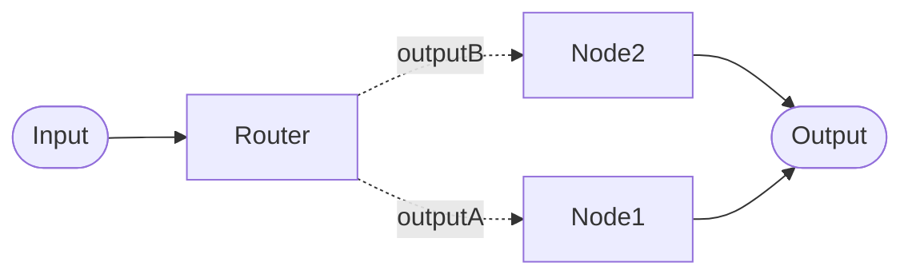

# Router Nodes

## Routers

Router nodes direct the conversation to different paths. Rather than following a single fixed workflow, a pipeline with routers can behave differently depending on what the user says or what is known about them.

Router nodes allow you to route (ie pass through) the input to one of the downstream linked nodes. It selects an path based on the input conversation context.

For example, you might route new users to an onboarding flow while returning users go straight to the main menu, or send a message to a specialist node if the user asks about a particular topic.

!!! note Examples

    See [chatbot workflow cookbook](../../how-to/workflow_cookbook.md) for example usage of pipelines using Routers in complex bots.

## Router Types
OCS has two types of Router Nodes:

1. **LLM Router** — uses an AI model to classify the input and choose the next step in the workflow
2. **Static Router** — chooses a workflow path based on a stored data value

!!! tip "For technical configuration"

    See [Router Nodes on Tech Hub](../../tech-hub/routers/index.md) for configuration details and best practices.

### LLM Router Node

This uses an AI model to classify incoming messages (ie **input** prompt) into one of your defined **Output Keywords**. This effectivly selects an output tha connects to a downstream node.

You define **outputs** in the [router node settings](../../tech-hub/routers/llm_router.md#outputs-and-default-route).

The model will pick the closest match. If the LLM cannot confidently match to any of the configured **outputs**, the router choses the **default** output — marked with a blue `*` in the interface.

### Static Router Node

The Static Router routes the conversation based on a value stored in your data — such as a participant's profile or session information. It does not use an AI model; it simply looks up a key and follows the matching output.

This is useful for directing users based on known attributes, such as their preferred language, their subscription tier, or a flag set earlier in the conversation.

If the key is not found in the data, the message is sent along the **default** output.
