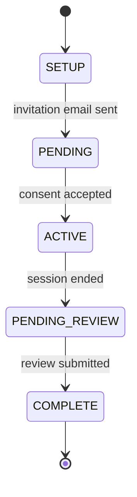
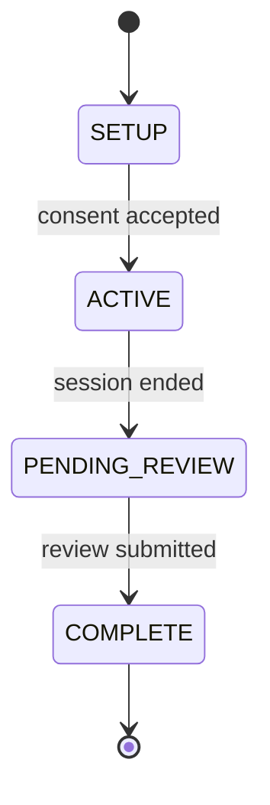

# Session Status

Every [chat session](sessions.md) in Open Chat Studio has a **status** that reflects where the participant is in their journey — from first contact through to a completed, reviewed conversation.

Understanding session status helps you:

- Predict how participants will move through your chatbot's flow.
- Choose the right method to end a session from within the bot.
- Interpret session lists, exports, and reports correctly.

## The statuses

| Status | Label | What it means |
|--------|-------|---------------|
| `SETUP` | Setting Up | A session has been created but the participant has not yet been contacted or arrived. This is the default starting point for every session. |
| `PENDING` | Awaiting Participant | The participant has been invited (for example, by email) or prompted for consent, but has not yet agreed to start. |
| `PENDING_PRE_SURVEY` | Awaiting Pre-Survey | The participant has consented and was waiting to complete a pre-conversation survey before the chat began. This status is no longer reachable — the Surveys feature has been permanently removed. Existing sessions that reached this status before the removal will remain here. |
| `ACTIVE` | Active | The conversation is in progress. |
| `PENDING_REVIEW` | Awaiting Final Review | The conversation has ended and is waiting for the participant to submit the post-conversation review or for an admin to review the session. |
| `COMPLETE` | Complete | The session is fully finished. No further activity is expected. |
| `UNKNOWN` | Unknown | A safety fallback for sessions in unexpected states. Sessions are never deliberately placed here. |

## How sessions move through statuses

Sessions flow through statuses automatically. The path depends on how the participant arrived and what features are configured for your chatbot.

### Web invitation flow

Used when participants arrive via an invitation link or public web chat link. The path differs depending on whether the participant was invited by email or arrived via a public link.

**Invitation email flow** — the session is created in `SETUP`, the email is sent, and the participant accepts consent on the invitation page:



**Public link flow** — the session is created and immediately moves out of `SETUP` as the participant accepts consent on arrival:



!!! note "PENDING_PRE_SURVEY"
    The `PENDING_PRE_SURVEY` status is no longer reachable. The Surveys feature has been permanently removed. Sessions that reached this status before the removal will remain in it, but no new sessions will enter it. See [Surveys (Removed)](../how-to/setting_up_a_survey.md) for details.

### Messaging channel flow

Used for [channels](channels.md) such as Telegram, WhatsApp, the web widget, and the API.

- **If [conversational consent](consent.md) is disabled** (the common case): the session is created directly in `ACTIVE`. The early statuses are skipped entirely.
- **If conversational consent is enabled**: the bot walks the participant through a chat-driven consent flow, traversing `SETUP → PENDING → ACTIVE`.

!!! note
    Messaging channel sessions do not typically reach `PENDING_REVIEW` or `COMPLETE` on their own. Those terminal statuses are driven by the post-conversation review form or an explicit end-conversation action.

## Reaching the terminal statuses

### PENDING_REVIEW

A session moves to `PENDING_REVIEW` whenever the conversation ends. This can happen in several ways.

**Participant actions:**

- Clicks **End chat** on the web chat page.
- Sends `/reset` on a messaging channel (also surfaced as "Restart chat" on Telegram).

**Bot-driven actions** (see [Ending sessions from a chatbot](#ending-sessions-from-a-chatbot) below):

- An LLM tool call ends the session.
- A Python pipeline node calls `end_session()`.
- An [event](events.md) with an **End the conversation** action fires.

**Team member actions:**

- Clicks **End session** on a session detail page in the OCS admin.
- Clicks **New session** on a messaging channel session, which ends the old session as a side effect.

**API:**

- An integrator calls the public end session endpoint.

### COMPLETE

There is exactly one path to `COMPLETE`: the participant is redirected to the review page after the chat ends, and they submit the review form. If the participant closes the browser without submitting, the session remains in `PENDING_REVIEW` indefinitely.

### UNKNOWN

No deliberate action places a session in `UNKNOWN`. It exists as a defensive fallback. If you see sessions landing here, this indicates an unexpected state — worth investigating rather than ignoring.

## Ending sessions from a chatbot

You have three ways to end a session programmatically from within your chatbot. All three behave identically once triggered — the session moves to `PENDING_REVIEW`, the end time is recorded, and any configured conversation-end [events](events.md) fire.

### The End Session tool

Add the **End Session** tool to your LLM node's tool list. The LLM can then choose to end the chat when it judges the conversation is over.

The tool description presented to the LLM is: *"End the current chat session. This will mark the session as completed. New messages will result in a new session being created."*

In that description, "completed" means the conversation is finished — the session moves to `PENDING_REVIEW`. It does not move directly to the `COMPLETE` status, which only happens once the participant submits the post-conversation review.

The session ends after the bot's reply is delivered to the participant.

For full configuration details, see the [End Session tool reference](../tech-hub/tools.md#end-session).

!!! warning "Not available for Assistant-style bots"
    The End Session tool cannot be used with Assistant-style chatbots.

Use this approach when the decision to end the conversation belongs to the LLM — for example, "end the session once the user confirms they are done".

### The `end_session()` helper in a Python node

Inside a [Python pipeline node](../tech-hub/python_node.md), the runtime exposes an `end_session()` helper:

```python
def main(input, **kwargs):
    if should_finish(input):
        end_session()
    return "Goodbye!"
```

Calling `end_session()` ends the session after the pipeline finishes and the response is delivered. The returned message is still sent to the participant first.

Use this approach when the decision to end the conversation belongs to your custom logic — for example, a state-machine progression or a specific sentinel input from the participant.

### Events with an "End the conversation" action

Configure an [event](events.md) whose action is **End the conversation**:

- **Static triggers** — fire on a lifecycle event such as a new bot message, a participant joining, or a conversation starting. Useful when you want the session to end as soon as the bot sends a specific goodbye message.
- **Timeout triggers** — fire after a period of inactivity. Useful for "end the session if the participant is silent for 30 minutes".

Use this approach when the decision to end the conversation should be driven by lifecycle conditions outside the pipeline itself.

## Observing how a session ended

Regardless of what ends a session — participant, bot, admin, API caller, or event — you can attach further actions to the conversation-end event using static triggers. This lets you respond differently depending on who or what ended the conversation.

| Trigger type | Fires when |
|--------------|------------|
| The Conversation is Ended by the Participant | The participant ends the chat (web "End chat" or `/reset`). |
| The Conversation is Ended by the Bot | The bot ends the chat (End Session tool or `end_session()`). |
| The Conversation is Ended via the API | An API caller ends the session. |
| The Conversation is Ended by an Event | An "End the conversation" event action ended the session. |
| The Conversation is Manually Ended by an Admin | A team member ended the session via the OCS admin. |

The generic **Conversation End** trigger fires for all of the above. Use it when you want to take the same action regardless of how the session ended. See [Events](events.md) for more detail.

## Status and reporting

Three statuses are treated as "this chat is over" for the purposes of filtering, exports, and reports:

- `PENDING_REVIEW`
- `COMPLETE`
- `UNKNOWN`

`UNKNOWN` is included here because sessions in this state will not progress further — they have left the normal flow and should not be treated as in-progress conversations. Only `COMPLETE` is considered fully done — meaning the participant has submitted the post-conversation review.

## Things to keep in mind

- **Status is managed automatically.** OCS transitions sessions through the flow. You do not need to set it manually.
- **Channel sessions usually start in ACTIVE.** If you are wondering why a session is already active before any interaction, check whether [conversational consent](consent.md) is enabled on your chatbot.
- **UNKNOWN is a fallback, not a destination.** If sessions are landing in `UNKNOWN`, something unexpected has occurred. Investigate rather than treating it as a normal terminal state.
