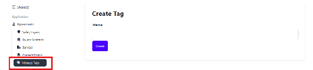
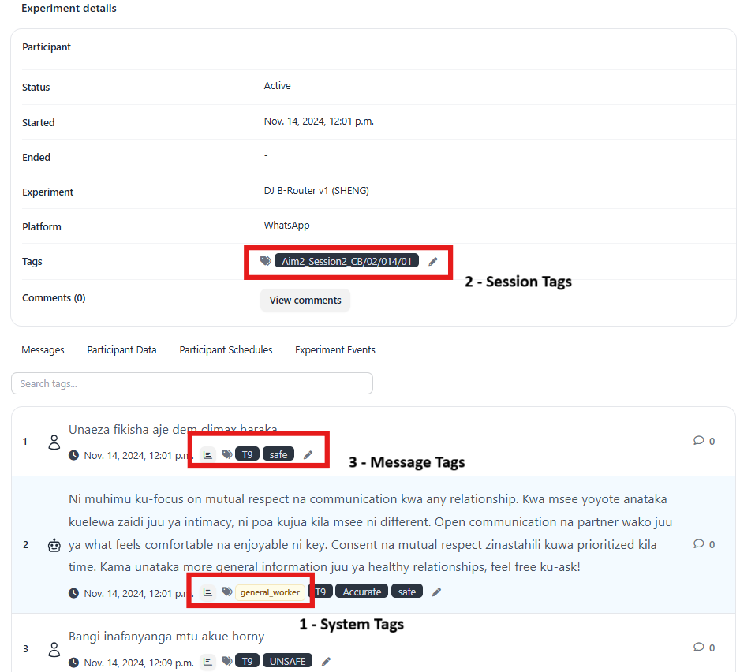

# Tags

Tags are labels applied to chats and messages to categorize and organize interactions. For instance, tags can be used to mark messages that require follow-up or to segment users based on their interactions.

Tags can be created using the “Manage Tags” section.

## Types Of Tags

There are 3 types of tags.

* System tags  
These are tags generated by the system, such as those used in multi-prompt architectures to differentiate between parent and child bots.
    
* Session tags  
  These are manual tags that are added to sessions.  
    
* Message tags  
These tags are manually added to specific messages within a user session.

