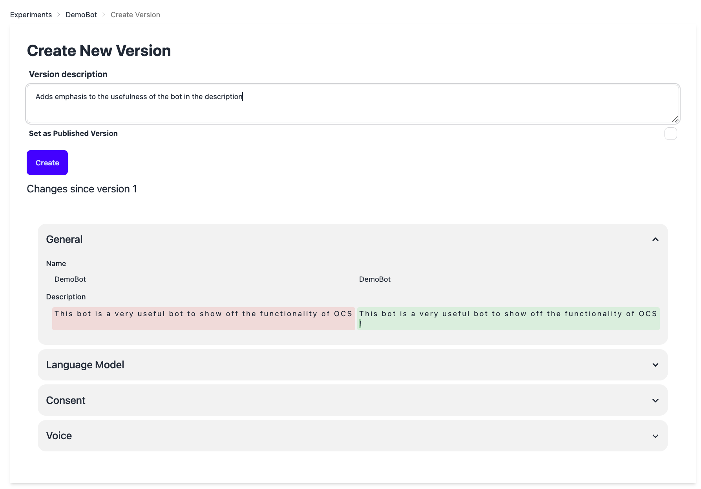
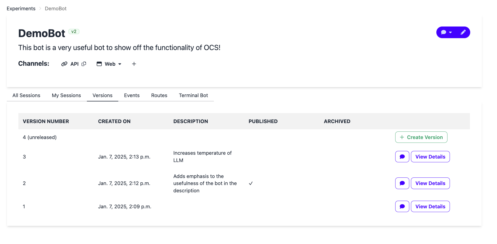

# Versioning

Versioning is now enabled by default for all projects on Open Chat Studio. This comes with a few important changes that modify the default behavior of the platform.

## Terms
OCS uses the following terms:

* *Unreleased Version*. This is the version of the chatbot that exists when you click the edit button on the experiment. It can also be considered a "draft" or that it has "unsaved changes".

* *Published Version*. This is the version that users will interact with through the web, WhatsApp or any other configured channel--including the public link.

!!! info "A note version functionality"
    Once a version is made, it cannot be edited or modified. This ensures that the users' experience remains stable even if the authors may be changing the unreleased version.

!!! warning "Chatting to the unreleased version"

    To chat to the unreleased version, navigate to the Experiment home page and click on the speech bubble icon at the top right corner of the page. There, a drop down will say either "Unreleased Version" or "Published Version". Select the Unreleased Version, and that will open a web chat. Only bot authors can chat with the unreleased version as it is not available through channels.This is a change in the default behavior of the platform as prior to versioning, all channels chatted to the unreleased version at all times.

#### Changing the Published Version
The published version can be selected from any released version of the experiment. To modify which version is the published version:

- Select "View Details" of the version
- Press the "Set as Published Version" button at the button of the dialog box.

Alternatively, when a new version is being created, it can be set as the published version by marking the checkbox "Set as Published Version".

Only one version can be the published version at a time.

## Workflow

When a new experiment is first created, there exists two versions, a published version and a unreleased version as shown in the version table:

Then, when you would like to create another version after making changes to the unreleased version, you can either press the create version button on the table, or navigate to the edit experiment page and scroll to the bottom to locate the create version button. Note: this button will only be enabled if changes have been made to the version.

That will take you the the create new version page which will show you the difference between the previous version (note not the published version) and the unreleased version. Here, you can also set this newly created version as the published version. Also, there is an option to add a description to the version that will be shown in the version table to quickly remember the changes between versions.

Tada! There you have a new released version! You will be directed back the experiment verisons table where it may take a few minutes for the version to be fully available. Then you can chat with the version and view its details. When you select view details it shows the the detailed specifications of that version and if you navigate to the bottom, you are able to set as the published version and archive from that screen.

If you click on the webchat button, for an unpublished version, there will be a banner indication that it's the unpublished version, and which version it is:

For this demo, I released a few more versions for this experiment and also changed the published version. To easily see which is the published version for the experiment, look right of the experiment name at the top of the experiment home screen at the icon in green. For this example, you'll see "v2" which indicates that the version 2 is the published version. You will also be able to see in the table looking at the published verion row for the checkmark.

