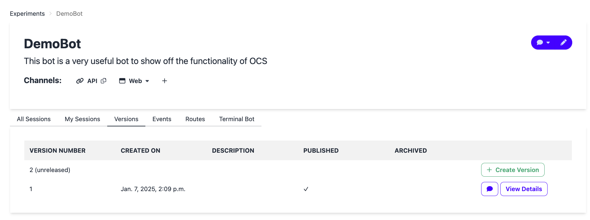
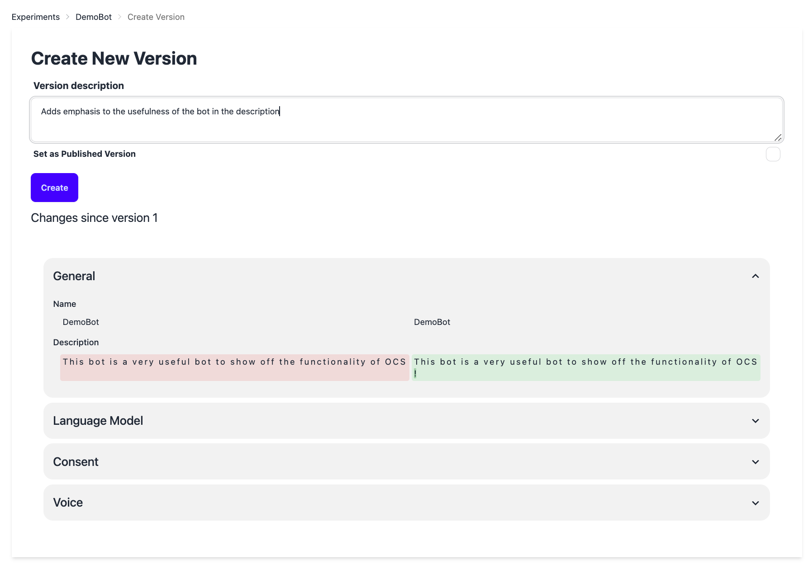
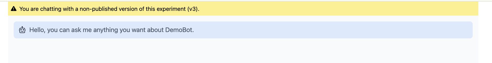

# Versioning

Versioning is now enabled by default for all projects on Open Chat Studio. This comes with a few important changes that modify the default behavior of the platform.

## Terms
OCS uses the following terms:

* *Unreleased Version*. This is the version of the chatbot you are currently editing using the edit button. It can also be considered a draft with unsaved changes.

* *Published Version*. This is the version that users will interact with through the web, WhatsApp or any other configured channel--including the public link.

!!! info "A note on version functionality"
    Once a version is made, it cannot be edited or modified. This ensures that the users' experience remains stable even if the authors may be changing the unreleased version.

!!! warning "Chatting to the unreleased version"

    To chat with the unreleased version, go to the chatbot home page and click the speech bubble icon in the top-right corner. In the dropdown, select "Unreleased Version" instead of "Published Version" to open a web chat. Only bot authors can chat with the unreleased version because it is not available through channels. This differs from behavior before versioning, when all channels always used the unreleased version.

#### Changing the Published Version
The published version can be selected from any released version of the chatbot. To choose which version is the published version:

- Select "View Details" of the version
- Press the "Set as Published Version" button at the button of the dialog box.

Alternatively, when a new version is being created, it can be set as the published version by marking the checkbox "Set as Published Version".

Only one version can be the published version at a time.

## Workflow

When a new chatbot is first created, it has two versions: a published version and an unreleased version, as shown in the version table:

After making changes to the unreleased version, you can create another version by either clicking the create version button in the table or navigating to the chatbot edit page and scrolling to the bottom. Note: this button is enabled only when changes have been made.

That will take you the the create new version page which will show you the difference between the previous version (note not the published version) and the unreleased version. Here, you can also set this newly created version as the published version. Also, there is an option to add a description to the version that will be shown in the version table to quickly remember the changes between versions.

You now have a new released version. You will be directed back to the chatbot versions table, where it may take a few minutes for the version to be fully available. You can then chat with that version and view its details. The "View Details" page shows full specifications and lets you set the version as published or archive it.

If you click on the webchat button, for an unpublished version, there will be a banner indication that it's the unpublished version, and which version it is:

For this demo, I released a few more versions for this chatbot and changed the published version. To quickly see which version is published, look to the right of the chatbot name at the top of the chatbot home screen for the green version badge. In this example, "v2" indicates that version 2 is published. You can also confirm this in the table by checking for the checkmark on the published row.

!!! info "Versioning chatbots that use OpenAI Assistants"
    Can this be done? Yes. When a chatbot that uses an OpenAI Assistant is released, no additional configuration is required. A read-only copy of the OpenAI Assistant is created in Open Chat Studio (see the Assistants tab) and in OpenAI, including all referenced files. The original OpenAI Assistant remains available and can still be modified in the unreleased chatbot version.

!!! warning "Modifying Assistants in OpenAI referenced by released versions"

    As mentioned above, the copied assistant will be read-only in OCS, however, in OpenAI changes can still be made to that copy of the assistant. *We recommend advising your team to not modify this assistant if it references a released version.* This can cause unexpected behavior to the version and to its end users. To ensure that the released version acts as expected this assistant should remain as-is.
