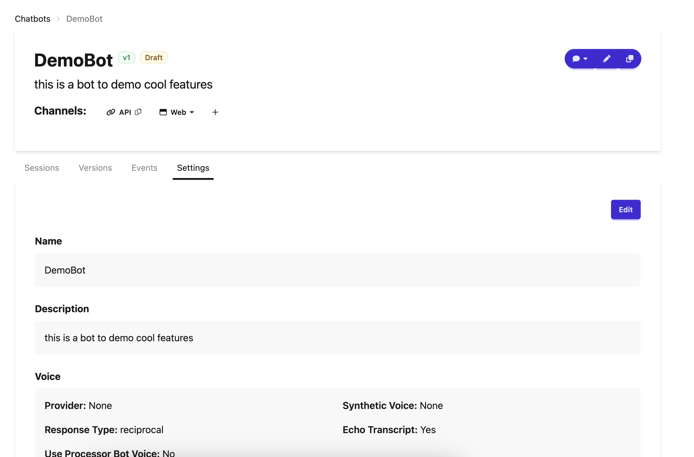

# FAQ: Move Experiements to Chatbots
An ['Experiment'](../concepts/experiment/index.md) was the  name used in Open Chat Studio to refer to a 'chatbot'. This is now a legacy term as we transition fully to the term ['Chatbots'](../concepts/chatbots/index.md).

## Self-Managed Rollout
Team administrators can now control feature flags for their teams, allowing for more granular control over when new features are enabled. This means teams can adopt the Chatbots feature at their own pace rather than following a global rollout schedule.

## Key improvements for moving to Chatbots:
- **Simplified Workflow**: Chatbots introduces a cleaner, more intuitive interface for building chatbots
- **Streamlined Bot Building**: We're transitioning from the 'form-based' approach to make pipelines the primary (and eventually only) method for bot building
- **Enhanced Features**: The new system allows building more bots with greater flexibility and complexity.
- **Enhanced Features**: Chatbots includes features that are not available to legacy 'Experiments' including:
    - LLM tools such as 'web search', 'code interpreter', and 'file search'

## Timeline
- September 10th 2025: Team admins can enable the Chatbot Feature Flag for their team via the feature flag management page.
- September 10th 2025: Chatbot Feature Flag is enabled for all teams
- October 1st 2025: All legacy experiments are migrated to chatbots. Pipeline experiments are filtered out from the pipeline table.

## Are my existing Experiments going to be lost after the upgrade from Experiments to Chatbots?
No! This update is solely in the bot building experience and not in the end product the user sees. All existing experiments will be seamlessly transferred over to Chatbots without change in any of the chatbot functionality.

## What do I have to do during the Experiments to Chatbots transition?
Nothing! All of your experiments will be transferred over to use chatbots automatically. You will receive updates on the progress of the transition via banners on the site.

## How do I adjust the global settings of my chatbot?
Different from an Experiment, the settings have been moved to a tab on the Chatbot homepage.
<figure markdown="span">
  
  <figcaption>The settings tab</figcaption>
</figure>
Here, you are able to modify name, description, voice, tracing, consent, surveys, participant allowlist, and seed message.

## How can I control feature rollouts for my team?
Team administrators can manage the chatbot feature for their team.

To access feature flag management:

1. Navigate to your team's settings page
2. Click on the "Manage Feature Flags" button

<figure markdown="span">
  
  <figcaption>Feature Flag Management</figcaption>
</figure>

<figure markdown="span">
  
  <figcaption>Feature Flag Management Page</figcaption>
</figure>
