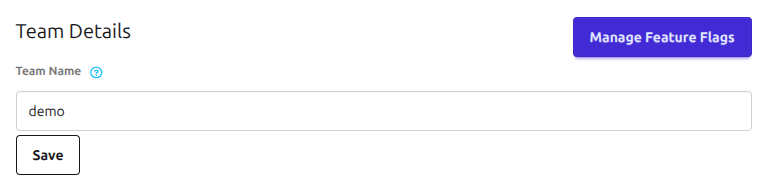
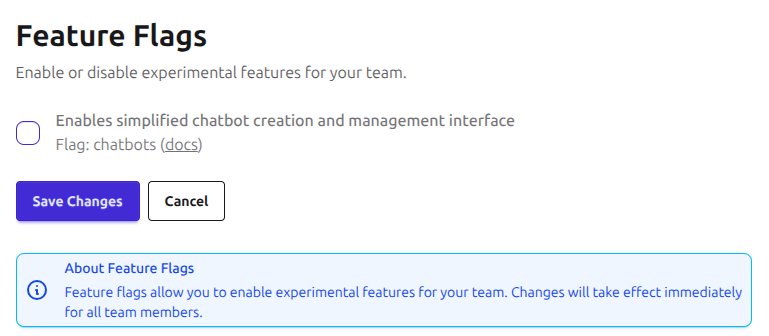

# Frequently Asked Questions

## How can I control feature rollouts for my team?
Team administrators can use flags to show or hide the features for their team.

To access feature flag management:

1. Navigate to your team's settings page
2. Click on the "Manage Feature Flags" button

<figure markdown="span">
  
  <figcaption>Feature Flag Management</figcaption>
</figure>

<figure markdown="span">
  
  <figcaption>Feature Flag Management Page</figcaption>
</figure>

## Moving "Experiments" to Chatbots

An ['Experiment'](../concepts/experiment/index.md) was the name used in Open Chat Studio to refer to a 'chatbot'. This is now a legacy term as we transition fully to the term ['Chatbots'](../concepts/chatbots/index.md).

### Key improvements for moving to Chatbots:
- **Simplified Workflow**: Chatbots introduces a cleaner, more intuitive interface for building chatbots
- **Streamlined Bot Building**: We're transitioning from the 'form-based' approach to make pipelines the primary (and eventually only) method for bot building
- **Enhanced Features**: Chatbots includes features that are not available to legacy 'Experiments' including LLM tools such as 'web search', 'code interpreter', and 'file search'

