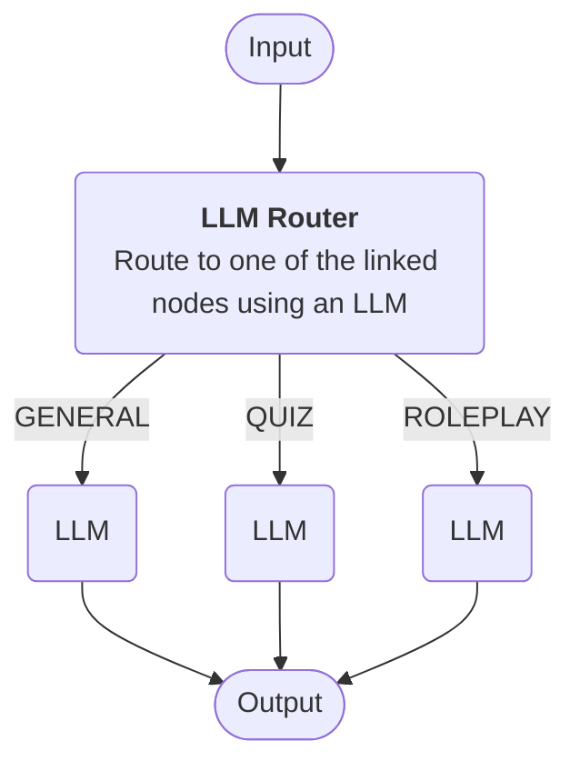
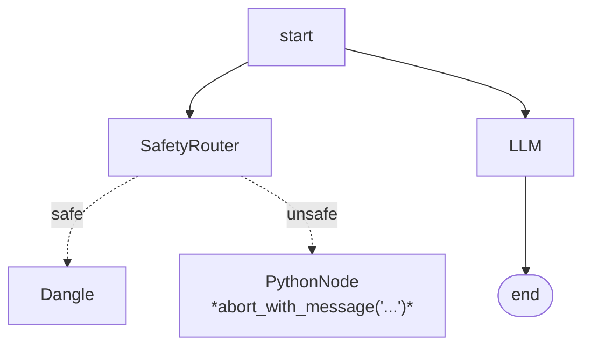

# Chatbot Workflow Cookbook

## Split bot into multiple smaller bots

For complex bots it may be the case that a single LLM node with a large prompt does not perform well. For example, a bot that is expected to perform multiple different functions such as Role Play, Quiz, Q&A.

In such cases, it can be better to create smaller, narrowly focused prompts and use a router to select which 'mode' the bot is currently in.

Here is a more complex example that uses a [LLM Router][router] to route the input to one of three linked nodes.



## Safety check in parallel
In this example, we are using a [**Router**][router] to determine if the user input complies with the usage policy of the bot. The router has two outputs, **safe** and **unsafe**. The **safe** output is not connected to any other nodes but the **unsafe** output is connected to a [**Python Node**][python] which will abort the pipeline with an error message.



If the **Safety Router** routes to the **Python Node**, the user will not see the output generated by the LLM node but will instead see a message generated by an LLM based on the message passed to the [`abort_with_message`][abort] function.

## Router for classification
Router nodes can have unconnected outputs as seen above, enabling more flexible routing patterns where not all paths need to be explicitly handled. It is also OK to connect multiple router outputs to the same input of another node. This can be useful if you want to the router node to categorize the input but not actually affect the execution flow.


You might use this to perform some logic in the [**PythonNode**][python]:

```python
def main(input, **kwargs):
    route = get_selected_route("RouterA")
    if route == "categoryA":
        set_temp_state_key("question", "A")
    elif route == "categoryB":
        set_temp_state_key("question", "B")
    return input
```

Then in the LLM node prompt you could use the [**temp_state**][prompt_vars] to inject the category:

```
The current category is {temp_state.category}
```

[abort]: ../concepts/pipelines/nodes.md#python_node.abort_with_message
[python]: ../concepts/pipelines/nodes.md#python_node
[router]: ../concepts/pipelines/nodes.md#llm-router
[prompt_vars]: ../concepts/prompt_variables.md
