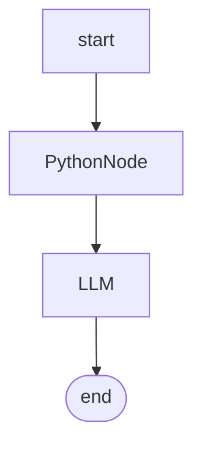
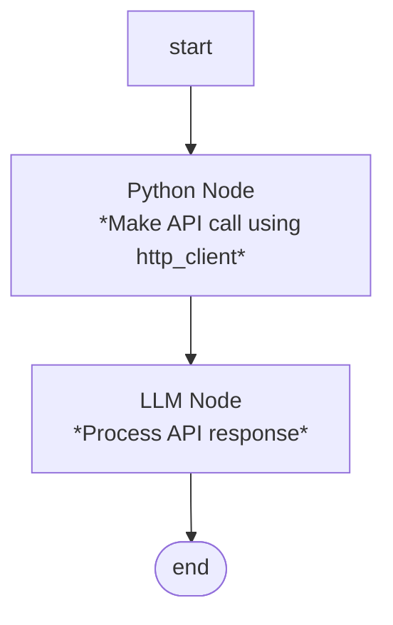

# Chatbot Workflow Cookbook

## Split bot into multiple smaller bots

For complex bots it may be the case that a single LLM node with a large prompt does not perform well. For example, a bot that is expected to perform multiple different functions such as Role Play, Quiz, Q&A.

In such cases, it can be better to create smaller, narrowly focused prompts and use a router to select which 'mode' the bot is currently in.

Here is a more complex example that uses a [LLM Router][router] to route the input to one of three linked nodes.


## Safety check in parallel
In this example, we are using a [**Router**][router] to determine if the user input complies with the usage policy of the bot. The router has two outputs, **safe** and **unsafe**. The **safe** output is not connected to any other nodes but the **unsafe** output is connected to a [**Python Node**][python] which will abort the pipeline with an error message.


If the **Safety Router** routes to the **Python Node**, the user will not see the output generated by the LLM node but will instead see a message generated by an LLM based on the message passed to the [`abort_with_message`][abort] function.

## Router for classification
Router nodes can have unconnected outputs as seen above, enabling more flexible routing patterns where not all paths need to be explicitly handled. It is also OK to connect multiple router outputs to the same input of another node. This can be useful if you want to the router node to categorize the input but not actually affect the execution flow.


You might use this to perform some logic in the [**PythonNode**][python]:

```python
def main(input, **kwargs):
    route = get_selected_route("RouterA")
    if route == "categoryA":
        set_temp_state_key("question", "A")
    elif route == "categoryB":
        set_temp_state_key("question", "B")
    return input
```

Then in the LLM node prompt you could use the [**temp_state**][prompt_vars] to inject the category:

```
The current category is {temp_state.category}
```

## Reading user uploaded files

This workflow allows users (participants) to upload files that your chatbot can process and analyze. Supported file types are listed [here][code_node_supported_file_types].

### Setup Steps

1. **Enable file uploads**: In your chatbot settings, enable the "File uploads enabled" option
2. **Create a Python Node**: Use a Python node to read and process the uploaded file contents from the [temporary state][temp_state] - specifically from the [attachments][attachments] key.
3. **Pass to LLM**: Either return the user input along with the file contents directly to the LLM node, or save the file contents to the temporary state and inject them into your LLM prompt

### Workflow Structure



**Python Node Implementation:**

*Option 1: Single File Processing*
Process only the first uploaded file:

```python
def main(input: str, **kwargs) -> str: 
    # Get uploaded files from temp state
    attachments = get_temp_state_key("attachments")
    if not attachments:
        return input
    
    # Read the first file's content
    file_content = attachments[0].read_text()
    set_temp_state_key("file_contents", file_content)
    
    return input
```

*Option 2: Multiple Files Processing*
Process all uploaded files:

```python
def main(input: str, **kwargs) -> str: 
    # Get uploaded files from temp state
    attachments = get_temp_state_key("attachments")
    if not attachments:
        return input
    
    # Read all files and combine their contents
    all_file_contents = []
    for i, attachment in enumerate(attachments):
        file_content = attachment.read_text()
        filename = attachment.name if hasattr(attachment, 'name') else f"File {i+1}"
        all_file_contents.append(f"## {filename}\n{file_content}")
    
    # Save combined contents to temp state
    combined_contents = "\n\n".join(all_file_contents)
    set_temp_state_key("file_contents", combined_contents)
    
    return input
```

In these examples, the Python node reads the uploaded file(s) and saves their contents to the temp state under the key "file_contents". The user's original input is passed through unchanged to the LLM node. 

**LLM Node Configuration:**

Configure your LLM node to utilize the uploaded file contents by injecting them into the prompt using temp state variables.

*Basic Prompt Template:*
```
You are a helpful assistant. Answer the user's query as best you can.

Here are some file contents that you should consider when generating your answer:

## File Contents
{temp_state.file_contents}

User Query: {input}

Instructions:
- If the file contents are empty or not provided, inform the user that no files were uploaded
- Base your response on both the file contents and the user's query
- Be specific about what you found in the uploaded files
- If you cannot find relevant information in the files, clearly state this
```

## Making external API calls

This workflow demonstrates how to integrate external APIs into your chatbot using the [HTTP Client][http_client]. The HTTP client allows your bot to fetch data from external services, submit information, or interact with third-party APIs securely.

### Prerequisites

1. **Enable network access**: Network access must be enabled for your pipeline (contact your team administrator if needed)
2. **Set up Authentication Provider** (if required): If the API requires authentication, configure an [Authentication Provider][auth_providers] in your team settings

### Workflow Structure



### Example 1: Fetch External Data

This example fetches weather information from an external API and passes it to the LLM for processing:

```python
def main(input, **kwargs) -> str:
    """Fetch weather data and prepare it for the LLM"""
    try:
        # Make GET request to weather API
        response = http_client.get(
            "https://api.weather.gov/gridpoints/TOP/31,80/forecast",
            timeout=10
        )

        if response.status_code == 200:
            data = response.json()
            forecast = data["properties"]["periods"][0]

            # Format the data for the LLM
            weather_info = f"""
Weather Forecast:
- Condition: {forecast['shortForecast']}
- Temperature: {forecast['temperature']}°F
- Wind: {forecast['windSpeed']} {forecast['windDirection']}
- Detailed Forecast: {forecast['detailedForecast']}
"""
            # Store in temp state for LLM prompt access
            set_temp_state_key("weather_data", weather_info)
            return input
        else:
            set_temp_state_key("weather_data", "Weather data unavailable")
            return input

    except Exception as e:
        set_temp_state_key("weather_data", f"Error: {str(e)}")
        return input
```

**LLM Prompt Configuration:**

```
You are a helpful weather assistant. Use the weather data provided to answer the user's question.

{temp_state.weather_data}

User Question: {input}

Instructions:
- Provide a clear, conversational response based on the weather data
- If weather data is unavailable, inform the user politely
```

### Example 2: Submit Data to External API

This example takes user input, submits it to an external API, and returns the result:

```python
def main(input, **kwargs) -> str:
    """Submit user feedback to external service"""
    try:
        # Prepare data from user input
        feedback_data = {
            "message": input,
            "timestamp": "2024-01-01T12:00:00Z",
            "user_id": get_participant_data().get("identifier", "unknown")
        }

        # POST to API with authentication
        response = http_client.post(
            "https://api.example.com/feedback",
            json=feedback_data,
            auth_provider="feedback-api-key",  # Reference to Auth Provider
            timeout=15
        )

        if response.status_code == 201:
            result = response.json()
            return f"Thank you for your feedback! Reference ID: {result['id']}"
        else:
            return "We encountered an issue submitting your feedback. Please try again later."

    except Exception as e:
        return f"Sorry, we couldn't process your feedback at this time: {str(e)}"
```

### Example 3: Enriching User Data

This workflow fetches additional information based on user input and enriches the conversation context:

```python
def main(input, **kwargs) -> str:
    """Look up product information from external catalog"""
    try:
        # Extract product ID from user input (simplified example)
        product_id = input.strip()

        # Query external product API
        response = http_client.get(
            f"https://api.example.com/products/{product_id}",
            auth_provider="product-api",
            timeout=10
        )

        if response.status_code == 200:
            product = response.json()

            # Store product details in temp state
            set_temp_state_key("product_name", product["name"])
            set_temp_state_key("product_price", product["price"])
            set_temp_state_key("product_description", product["description"])
            set_temp_state_key("product_available", product["in_stock"])

            return input
        elif response.status_code == 404:
            set_temp_state_key("product_error", "Product not found")
            return input
        else:
            set_temp_state_key("product_error", "Unable to fetch product details")
            return input

    except Exception as e:
        set_temp_state_key("product_error", str(e))
        return input
```

**LLM Prompt Configuration:**

```
You are a product support assistant.


Product Information: Not available ({{ temp_state.product_error }})

Product Information:
- Name: {{ temp_state.product_name }}
- Price: ${{ temp_state.product_price }}
- Description: {{ temp_state.product_description }}
- Availability: {{ "In Stock" if temp_state.product_available else "Out of Stock" }}


User Query: {input}

Instructions:
- Help the user with their product inquiry
- Use the product information provided above
- If product information is not available, help the user find what they need
```

### Best Practices for API Integration

1. **Always handle errors**: Wrap API calls in try-except blocks to gracefully handle failures
2. **Set appropriate timeouts**: Prevent requests from hanging indefinitely
3. **Use Authentication Providers**: Never hardcode API keys in your Python code
4. **Validate user input**: Sanitize any user input used in API calls
5. **Store results in temp state**: Use `set_temp_state_key()` to make API data available to LLM prompts
6. **Check status codes**: Always verify the response status before processing data
7. **Provide user feedback**: Return meaningful messages when API calls fail

See the [HTTP Client documentation][http_client] for more details on available methods, security features, and advanced usage.

[abort]: ../concepts/pipelines/nodes.md#python_node.abort_with_message
[python]: ../concepts/pipelines/nodes.md#python-node
[router]: ../concepts/pipelines/nodes.md#llm-router
[prompt_vars]: ../concepts/prompt_variables.md
[temp_state]: ../concepts/pipelines/nodes.md#temporary-state
[attachments]: ../concepts/pipelines/nodes.md#attachments
[code_node_supported_file_types]: ../concepts/pipelines/nodes.md#supported-file-types
[http_client]: ../concepts/pipelines/nodes.md#http-client
[auth_providers]: ../concepts/team/authentication_providers.md
