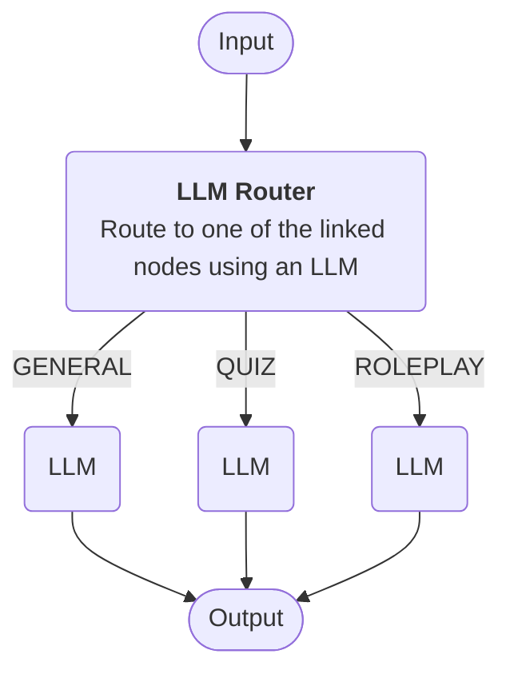
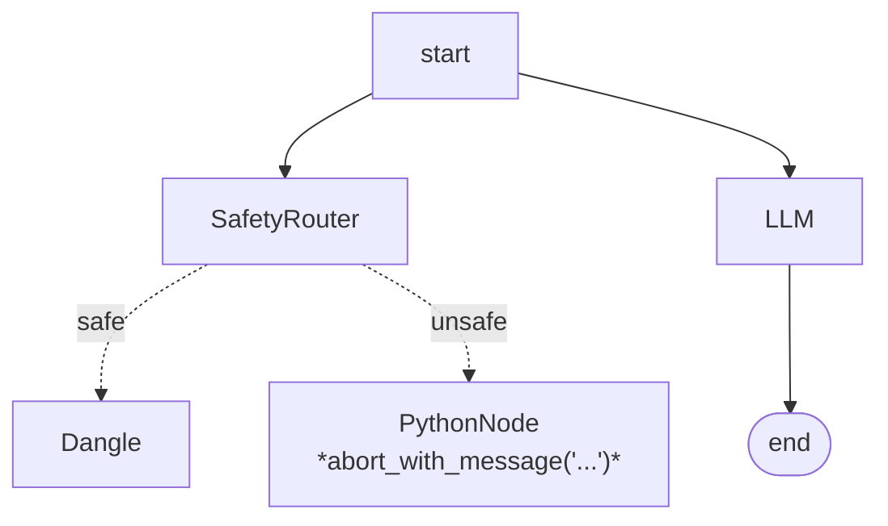
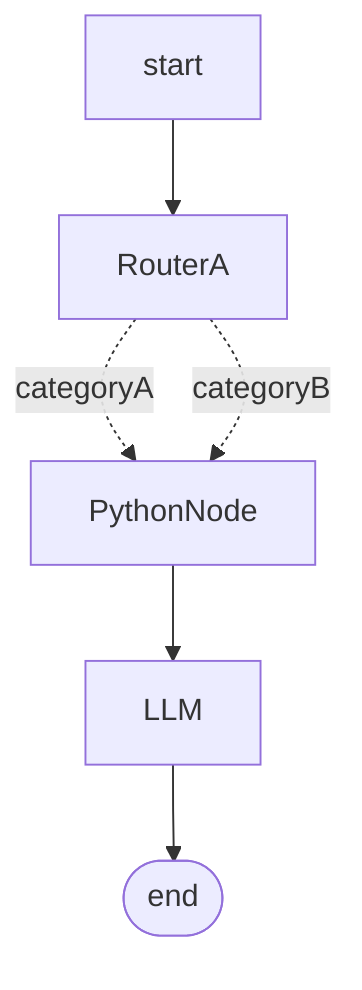
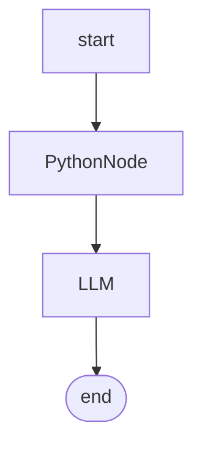

# Chatbot Workflow Cookbook

This cookbook collects common pipeline-building patterns, showing how nodes combine to solve real chatbot problems. It assumes you're already familiar with [Pipelines](../concepts/pipelines/index.md) and the available [Node Types](../concepts/pipelines/nodes.md). The recipes below focus on the LLM, Router, and Python nodes.

## Split a chatbot into multiple smaller chatbots

For complex chatbots it may be the case that a single LLM node with a large prompt does not perform well. For example, a chatbot that is expected to perform multiple different functions such as Role Play, Quiz, Q&A.

In such cases, it can be better to create smaller, narrowly focused prompts and use a router to select which 'mode' the chatbot is currently in.

Here is a more complex example that uses a [LLM Router Node][router_nodes] to route the input to one of three linked nodes. See [LLM Router Configuration](../how-to/routers/llm_router.md) for step-by-step setup configuration used here.


```mermaid
graph TB
  A@{ shape: stadium, label: "Input" } --> Router("`**LLM Router**
  Route to one of the linked nodes using an LLM`");
  Router -->|GENERAL| Gen(LLM);
  Router -->|ROLEPLAY| Rp(LLM);
  Router -->|QUIZ| Qz(LLM);
  Gen --> C@{ shape: stadium, label: "Output" };
  Qz --> C
  Rp --> C;
```

Conversation history works differently across these routed sub-chatbots than in a single-node pipeline — see [Conversation History](../concepts/pipelines/history.md) for how to keep the general, quiz, and roleplay nodes sharing the right context.

## Safety check in parallel
In this example, we are using a [**Router**][router_nodes] to determine if the user input complies with the usage policy of the chatbot. The router has two outputs, **safe** and **unsafe**. The **safe** output is not connected to any other nodes but the **unsafe** output is connected to a [**Python Node**][python] which will abort the pipeline with an error message.


```mermaid
flowchart TD
    start["start"] --> Safety["SafetyRouter"] & LLM
    Safety -. safe .-> Dangle:::hidden
    Safety -. unsafe .-> PythonNode["PythonNode
    *abort_with_message('...')*"]
    LLM --> __end__(["<p>end</p>"])

     start:::first
     __end__:::last
```

If the **Safety Router** routes to the **Python Node**, the participant will not see the output generated by the LLM node but will instead see a message generated by an LLM based on the message passed to the [`abort_with_message`][abort] function.

The unconnected **safe** output is an example of a [dangling node](../concepts/pipelines/parallel.md#dangling-nodes) — a valid pattern for router outputs that don't need any further processing.

## Router for classification
Router nodes can have unconnected outputs as seen above, enabling more flexible routing patterns where not all paths need to be explicitly handled. It is also OK to connect multiple router outputs to the same input of another node. This can be useful if you want to the router node to categorize the input but not actually affect the execution flow.

This pattern for reading the selected route works the same whether the router is an [LLM Router node](../concepts/pipelines/router_nodes.md#llm-router-node) or a [Static Router node](../concepts/pipelines/router_nodes.md#static-router-node)


```mermaid
flowchart TD
    start["start"] --> Router[RouterA]
    Router -. categoryA .-> PythonNode
    Router -. categoryB .-> PythonNode
    PythonNode --> LLM
    LLM --> __end__(["<p>end</p>"])

     start:::first
     __end__:::last
```

You might use this to perform some logic in the [**PythonNode**][python]:

```python
def main(input, **kwargs):
    route = get_selected_route("RouterA")
    if route == "categoryA":
        set_temp_state_key("question", "A")
    elif route == "categoryB":
        set_temp_state_key("question", "B")
    return input
```

Then in the LLM node prompt you could use the [**temp_state**][prompt_vars] to inject the category:

```text
The current category is {temp_state.category}
```

## Reading user uploaded files

This workflow allows users (participants) to upload files that your chatbot can process and analyze. Supported file types are listed [here][code_node_supported_file_types].

### Setup Steps

1. **Enable file uploads**: In your chatbot settings, enable the "File uploads enabled" option
2. **Create a Python Node**: Use a Python node to read and process the uploaded file contents from the [temporary state][temp_state] - specifically from the [attachments][attachments] key.
3. **Pass to LLM**: Either return the user/participant input along with the file contents directly to the LLM node, or save the file contents to the temporary state and inject them into your LLM prompt

### Workflow Structure


```mermaid
flowchart TD
    start["start"] --> PythonNode
    PythonNode --> LLM
    LLM --> __end__(["<p>end</p>"])

     start:::first
     __end__:::last
```

**Python Node Implementation:**

*Option 1: Single File Processing*
Process only the first uploaded file:

```python
def main(input: str, **kwargs) -> str:
    # Get uploaded files from temp state
    attachments = get_temp_state_key("attachments")
    if not attachments:
        return input

    # Read the first file's content
    file_content = attachments[0].read_text()
    set_temp_state_key("file_contents", file_content)

    return input
```

*Option 2: Multiple Files Processing*
Process all uploaded files:

```python
def main(input: str, **kwargs) -> str:
    # Get uploaded files from temp state
    attachments = get_temp_state_key("attachments")
    if not attachments:
        return input

    # Read all files and combine their contents
    all_file_contents = []
    for i, attachment in enumerate(attachments):
        file_content = attachment.read_text()
        filename = attachment.name if hasattr(attachment, 'name') else f"File {i+1}"
        all_file_contents.append(f"## {filename}\n{file_content}")

    # Save combined contents to temp state
    combined_contents = "\n\n".join(all_file_contents)
    set_temp_state_key("file_contents", combined_contents)

    return input
```

In these examples, the Python node reads the uploaded file(s) and saves their contents to the temp state under the key "file_contents". The participants's original input is passed through unchanged to the LLM node.

**LLM Node Configuration:**

Configure your LLM node to utilize the uploaded file contents by injecting them into the prompt using temp state variables.

*Basic Prompt Template:*

```text
You are a helpful assistant. Answer the user's query as best you can.

Here are some file contents that you should consider when generating your answer:

## File Contents
{temp_state.file_contents}

User Query: {input}

Instructions:
- If the file contents are empty or not provided, inform the user that no files were uploaded
- Base your response on both the file contents and the user's query
- Be specific about what you found in the uploaded files
- If you cannot find relevant information in the files, clearly state this
```

## Making external API calls

Pipelines can call external APIs directly from a [Python node][python] using the built-in `http` client. See [How to call external APIs](../tech-hub/external-api-calls/index.md) for worked examples that fetch external data, submit data to an external service, and enrich user data with details looked up from a third-party API. For authentication, file upload/download, and error handling, see the [HTTP Client reference](../tech-hub/external-api-calls/http_client.md).

[abort]: ../tech-hub/python_node.md#python_node.abort_with_message
[python]: ../tech-hub/python_node.md
[router_nodes]: ../concepts/pipelines/router_nodes.md
[prompt_vars]: ../concepts/prompt_variables.md
[temp_state]: ../tech-hub/python_node.md#temporary-state
[attachments]: ../tech-hub/python_node.md#attachments
[code_node_supported_file_types]: ../tech-hub/python_node.md#supported-file-types
