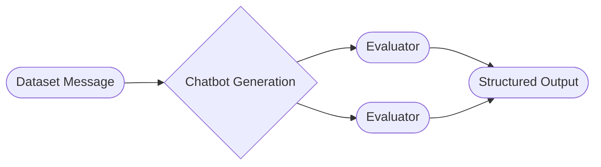

# Evaluations Reference

This section covers Open Chat Studio's advanced evaluation features: writing custom Python evaluators and configuring continuous dataset ingestion.

For a non-technical overview of datasets, evaluators, and how evaluation runs work, see [Evaluations](../../concepts/evaluations/index.md).

## Evaluation Execution

When an evaluation is run, each message from the dataset is first passed in to the defined chatbot (if applicable). The result, with the added generation output is then passed in to each evaluator in parallel. The evaluators output structured data. This data is compiled into a table, whose rows are each message and the columns are the evaluator output.

### Chatbot Generation

Messages can also optionally be passed in to a [chatbot](../chatbots/index.md), whose generation output will be available to the evaluators.

### Session Retention

When evaluations are run with chatbot generation enabled, temporary sessions are created to store the generated responses and conversation context. These evaluation sessions are automatically deleted after **30 days**.

!!! warning "Data Retention"
    Session deletion is permanent and cannot be undone. Ensure you export any evaluation results you need to retain before the 30-day retention period expires.

!!! note "Source Sessions Unaffected"
    This automatic deletion only affects sessions created during evaluation runs. Source sessions (the original sessions that datasets may be cloned from) are not affected by this retention policy and remain in the system according to their own lifecycle.

## Pages in this section

- **[Dataset Structure](./dataset-structure.md)** — field-level reference for dataset rows, cloning field mappings, history syntax, and CSV format details.
- **[Python Evaluator](./python_evaluator.md)** — write custom Python code to score messages, for deterministic rules or logic an LLM prompt can't reliably express. See [Evaluators](../../concepts/evaluations/evaluators.md#python-evaluator) for when to choose it over the LLM Evaluator.
- **[Auto-Population Rules](./auto_population.md)** — continuously ingest new sessions into a session-level dataset from a live chatbot, and trigger automatic delta evaluation runs against the new rows.
