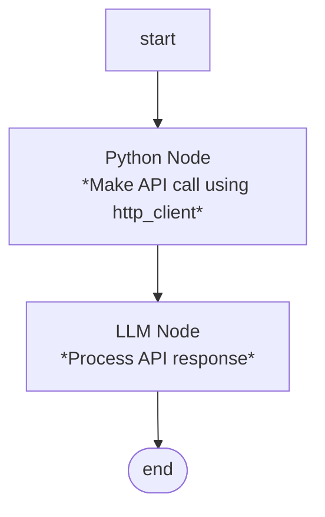

# How to call external APIs

In a Pipeline workflow you need to include a [Python node][python] which provides an `http` global that enables secure HTTP requests to external APIs.


!!! note Examples

    See [chatbot workflow cookbook](../how-to/workflow_cookbook.md) for examples of using Python Nodes in a Pipeline


## Example workflow

This workflow demonstrates how to integrate external APIs into your chatbot with the [HTTP Client][http_client]. The HTTP client allows your bot to fetch data from external services, submit information, or interact with third-party APIs securely.

### Prerequisites

1. **Enable network access**: Network access must be enabled for your pipeline (contact your team administrator if needed)
2. **Set up Authentication Provider** (if required): If the API requires authentication, configure an [Authentication Provider][auth_providers] in your team settings

### Workflow Structure



### Example 1: Fetch External Data

This example fetches weather information from an external API and passes it to the LLM for processing:

```python
def main(input, **kwargs) -> str:
    """Fetch weather data and prepare it for the LLM"""
    try:
        # Make GET request to weather API
        response = http.get(
            "https://api.weather.gov/gridpoints/TOP/31,80/forecast",
            timeout=10
        )

        if response["status_code"] == 200:
            data = response["json"]
            forecast = data["properties"]["periods"][0]

            # Format the data for the LLM
            weather_info = f"""
Weather Forecast:
- Condition: {forecast['shortForecast']}
- Temperature: {forecast['temperature']}°F
- Wind: {forecast['windSpeed']} {forecast['windDirection']}
- Detailed Forecast: {forecast['detailedForecast']}
"""
            # Store in temp state for LLM prompt access
            set_temp_state_key("weather_data", weather_info)
            return input
        else:
            set_temp_state_key("weather_data", "Weather data unavailable")
            return input

    except Exception as e:
        set_temp_state_key("weather_data", f"Error: {str(e)}")
        return input
```

**LLM Prompt Configuration:**

```
You are a helpful weather assistant. Use the weather data provided to answer the user's question.

{temp_state.weather_data}

User Question: {input}

Instructions:
- Provide a clear, conversational response based on the weather data
- If weather data is unavailable, inform the user politely
```

### Example 2: Submit Data to External API

This example takes user input, submits it to an external API, and returns the result:

```python
def main(input, **kwargs) -> str:
    """Submit user feedback to external service"""
    try:
        # Prepare data from user input
        feedback_data = {
            "message": input,
            "timestamp": "2024-01-01T12:00:00Z",
            "user_id": get_participant_data().get("identifier", "unknown")
        }

        # POST to API with authentication
        response = http.post(
            "https://api.example.com/feedback",
            json=feedback_data,
            auth="feedback-api-key",  # Reference to Auth Provider
            timeout=15
        )

        if response["status_code"] == 201:
            result = response["json"]
            return f"Thank you for your feedback! Reference ID: {result['id']}"
        else:
            return "We encountered an issue submitting your feedback. Please try again later."

    except Exception as e:
        return f"Sorry, we couldn't process your feedback at this time: {str(e)}"
```

### Example 3: Enriching User Data

This workflow fetches additional information based on user input and enriches the conversation context:

```python
def main(input, **kwargs) -> str:
    """Look up product information from external catalog"""
    try:
        # Extract product ID from user input (simplified example)
        product_id = input.strip()

        # Query external product API
        response = http.get(
            f"https://api.example.com/products/{product_id}",
            auth="product-api",
            timeout=10
        )

        if response["status_code"] == 200:
            product = response["json"]

            # Store product details in temp state
            set_temp_state_key("product_name", product["name"])
            set_temp_state_key("product_price", product["price"])
            set_temp_state_key("product_description", product["description"])
            set_temp_state_key("product_available", product["in_stock"])

            return input
        elif response["status_code"] == 404:
            set_temp_state_key("product_error", "Product not found")
            return input
        else:
            set_temp_state_key("product_error", "Unable to fetch product details")
            return input

    except Exception as e:
        set_temp_state_key("product_error", str(e))
        return input
```

**LLM Prompt Configuration:**

```
You are a product support assistant.


Product Information: Not available ({{ temp_state.product_error }})

Product Information:
- Name: {{ temp_state.product_name }}
- Price: ${{ temp_state.product_price }}
- Description: {{ temp_state.product_description }}
- Availability: {{ "In Stock" if temp_state.product_available else "Out of Stock" }}


User Query: {input}

Instructions:
- Help the user with their product inquiry
- Use the product information provided above
- If product information is not available, help the user find what they need
```

### Best Practices for API Integration

1. **Always handle errors**: Wrap API calls in try-except blocks to gracefully handle failures
2. **Set appropriate timeouts**: Prevent requests from hanging indefinitely
3. **Use Authentication Providers**: Never hardcode API keys in your Python code
4. **Validate user input**: Sanitize any user input used in API calls
5. **Store results in temp state**: Use `set_temp_state_key()` to make API data available to LLM prompts
6. **Check status codes**: Always verify the response status before processing data
7. **Provide user feedback**: Return meaningful messages when API calls fail

See the [HTTP Client documentation][http_client] for more details on available methods, security features, and advanced usage.


[python]: ../concepts/pipelines/python_node.md
[http_client]: ../concepts/pipelines/http_client.md
[auth_providers]: ../concepts/team/authentication_providers.md
