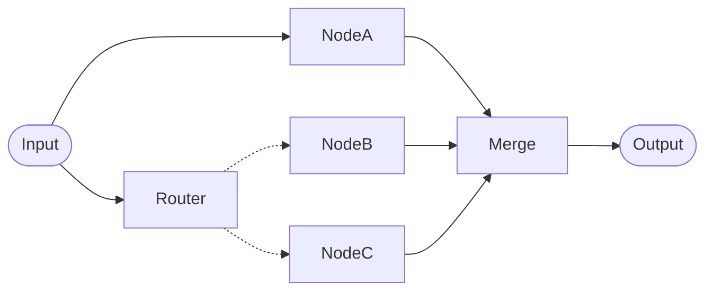

# Merging Parallel Branches

You can manage a merge node running more than once, or receiving only some of its expected branches, by using a `PythonNode` with some utility functions:

* `require_node_outputs`: This function will abort any node run if all the requested data is not available.
* `wait_for_next_input`: This is a lower level function that can be used when `require_node_outputs` isn't suitable.

For the execution model that causes a merge node to run more than once, and the meaning of `input` and `node_inputs`, see [Which input a node receives](../concepts/pipelines/parallel.md#which-input-a-node-receives) and [Uneven branches](../concepts/pipelines/parallel.md#uneven-branches) in Parallel Pipelines.

## Merging branches that always run

In the [uneven branches example](../concepts/pipelines/parallel.md#uneven-branches), we could use the following code in `NodeD` to merge the outputs:

```python
def main(input, **kwargs):
    # this will abort the first run since only `NodeB` has outputs
    require_node_outputs("NodeB", "NodeC")
    b = get_node_output("NodeB")
    c = get_node_output("NodeC")
    return f"{b}\n{c}"
```

Using the lower level `wait_for_next_input` function we can do the same thing:

```python
def main(input, **kwargs):
    b = get_node_output("NodeB")
    c = get_node_output("NodeC")
    if b is None and c is None:
        # abort until both are available
        wait_for_next_input()
    return f"{b}\n{c}"
```

## Merging branches that are optional

This shows a use case for the `wait_for_next_input` function. We have a pipeline which has parallel branches and a merge node but not all the branches will execute.



The `Merge` node will get outputs from `NodeA` and either `NodeB` or `NodeC`. We can't use `require_node_outputs` because not all outputs will be generated. Instead we need to use the `wait_for_next_input` function:

=== "Option 1"

    ```python
    def main(input, **kwargs):
        b = get_node_output("NodeB")
        c = get_node_output("NodeC")
        b_or_c = b or c
        if not b_or_c:
            # wait until we have either b or c
            wait_for_next_input()
        a = get_node_output("NodeA")
        return f"{a}\n{b_or_c}"
    ```

    Note that we don't need to check if we have output from `NodeA` since it will be guaranteed to be available by the time `NodeB` or `NodeC` execute due to the execution order.

=== "Option 2"

    This option makes use of the [`node_inputs`](python_node.md#additional-keyword-arguments) keyword argument which contains a list of all the inputs available to the current node execution. Since we want to wait until we have inputs from `NodeA and (NodeB or NodeC)` we can check that the inputs list has at least two values.

    ```python
    def main(input, **kwargs):
        all_inputs = kwargs.get("node_inputs", [])
        if len(all_inputs) < 2:
            # wait until we have at least two inputs
            wait_for_next_input()
        return "\n".join(all_inputs)
    ```

## Related pages

- [Parallel Pipelines](../concepts/pipelines/parallel.md) — the execution model behind uneven and optional branches
- [Python Node](python_node.md) — full reference for `require_node_outputs`, `wait_for_next_input`, `get_node_output`, and the other Python node utility functions
- [Workflow Cookbook](../how-to/workflow_cookbook.md) — worked examples combining routers, Python nodes, and other node types
