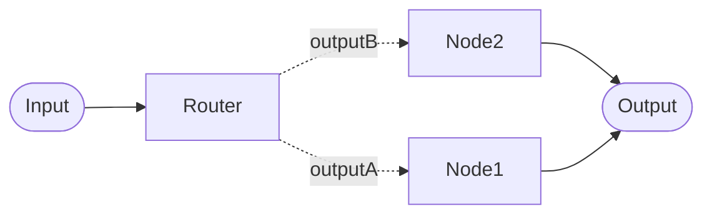

# LLM Router Configuration

The LLM Router uses an AI model to analyze an incoming message and classify it into a specific category. This category must match one of your defined **output keywords** to successfully hand off the conversation to a linked downstream node.

## Configuration: Outputs & Keywords
You manage your Router Node through the Advanced Settings.

- **Outputs**: These are the paths that link the router to downstream nodes. You must configure one output for every specialized path in your workflow.
- **Keywords**: A Keyword is the unique label assigned to a pipeline workflow path. It's labeled as **output keyword** in Advanced Settings UI.
    - Uniqueness: Each Keyword within a single Router Node must be unique.
    - The Handshake: The LLM produces a word. If that word matches a Keyword on an output line, the conversation follows that path.
- **The Default Route**: One keyword (marked with a blue *) acts as the Default. If the LLM generates a word that doesn't match your list, or if an error occurs, OCS will automatically use this path.

Example: Configure an **output keyword** for each of linked downstream nodes you need for your workflow paths. The keyword name should describe the path. For example "HIV", "TB" and "GENERAL" for the 3 possible workflow paths.

#### Keyword Case Behaviour
To ensure technical consistency, OCS handles keywords with the following rules:
- Automatic Uppercase: All Keywords are stored in UPPERCASE. While matching is case-insensitive (e.g., `Help` matches `HELP`), we recommend using uppercase during configuration for clarity.

## Prompt Design: The Classifier

To ensure reliable routing, the LLM prompt must be written as a Classifier. Its goal is to return a single, constrained choice.

- Clear Categorization: Explicitly describe each category in the prompt and instruct the model to "Output ONLY the keyword."
- Contextual Accuracy: Provide enough detail so the model can distinguish between overlapping topics.
  - Example: "If the user asks about account settings, output `SETTINGS`. If they ask about a refund, output `BILLING`. Output nothing else."

## Technical Performance: History Mode
It is strongly advisable to use [Node history mode](../../concepts/pipelines/history.md#node) for an LLM Router. 

Why? If the router sees the full conversation history, it might be influenced by previous routing decisions (e.g., seeing that it chose "Billing" in the last turn and repeating it incorrectly). Node history ensures the LLM focuses only on the most recent user input.

## Route Tagging

See [Route Tagging details](index.md#route-tagging-observability)
