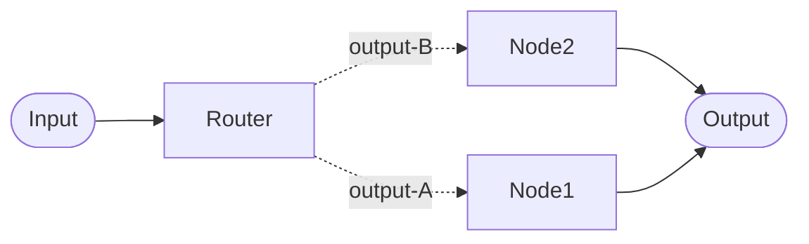

# LLM Router Configuration

The LLM Router uses an AI model to analyze an incoming message and classify it into a specific category. This category must match one of your defined **output keywords** so the conversation is routed to the correct downstream node.

## Configuration: Outputs & Keywords
You manage your router node through the Advanced Settings.

- **Outputs**: These are paths that link the router to downstream nodes. Configure one output for each specialized path in your workflow.
- **Keywords**: A keyword is the unique label assigned to an output path. In the Advanced Settings UI, this is shown as **output keyword**.
  - Uniqueness: Each keyword within one Router node must be unique.
  - Matching: The LLM returns one word. If that word matches an output keyword, the conversation follows that path.
- **The Default Output**: One output keyword (marked with a blue *) acts as the Default Output. If the LLM returns a word that does not match your list, or if an error occurs, OCS automatically uses this output.

Example: Configure one **output keyword** for each linked downstream node in your workflow. The keyword should describe the path, for example `HIV`, `TB`, and `GENERAL` for three possible workflow paths for advice on a disease.

#### Keyword Case Behavior
To ensure technical consistency, OCS handles keywords with the following rules:
- Automatic Uppercase: All keywords are stored in uppercase. While matching is case-insensitive (for example, `Help` matches `HELP`), we recommend using uppercase during configuration for clarity.

## Prompt Design: The Classifier

To ensure reliable routing, write your prompt as a classifier. Its goal is to return exactly one valid keyword.

- Clear Categorization: Explicitly describe each category in the prompt and instruct the model to "Output ONLY the keyword."
- Contextual Accuracy: Provide enough detail so the model can distinguish between overlapping topics.
  - Example Prompt: "If the user asks about account settings, output `SETTINGS`. If they ask about a refund, output `BILLING`. Output nothing else."
- Clear Examples: Provide 2-3 "golden examples" for each path to increase accuracy for edge cases
  - Example Prompt: "If they say X, go to Path A"

## Technical Performance: History Mode
We strongly recommend using [Node history mode](../../concepts/pipelines/history.md#node) for an LLM Router.

Why? If the router sees full conversation history, it can be biased by earlier routing decisions (for example, repeating "BILLING" because it selected it previously). Node history helps the LLM focus on the most recent user input.

## Cost of LLM model
You can choose a cheaper model if the complexity of classification of the message into one of the output keywords is low.

## Route Tagging

See [Route Tagging details](index.md#route-tagging-observability)
