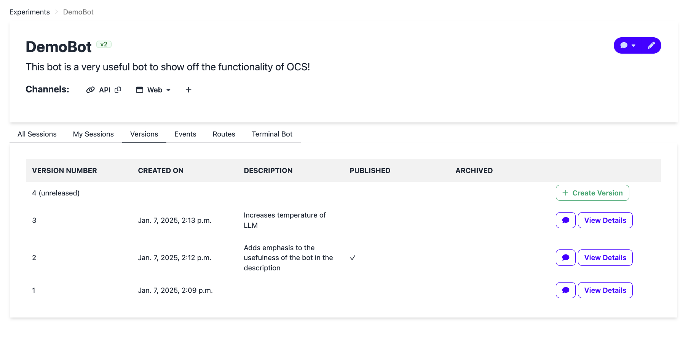

# Creating and Publishing Chatbot Versions

These steps explain the workflow for creating new chatbot versions and publishing versions, illustrating the [Versioning](../concepts/versioning.md) feature.

When a chatbot is first created, it has two versions: a published version and an unreleased version, as shown below.

## Step 1: Edit your chatbot

Open your chatbot and make your changes in the pipeline editor. All edits apply to the unreleased version.

## Step 2: Create a new version

Once you have tested and are ready to release the chatbot to your users, create a new version by clicking the **Create Version** button in the versions table.

## Step 3: Review and save the version

You will be taken to the create new version page, which shows you the difference between the most recent version and the unreleased version. The most recent version may be different from the currently published version.

Pressing the **Create** button saves the current configuration of the chatbot and allocates it a version number.

Here you can:

- Add a description to help identify what changed.
- Check **Set as Published Version** to make this version live immediately.  If you skip this checkbox, the version is saved but not yet published — you can publish it later via Step 5."

## Step 4: Confirm and test the version

You will be directed back to the versions table. It may take a few minutes for the new version to be fully available and listed in the table. From the table, you can select which Chatbot version you want to open a web chat with for testing.

## Step 5: Publish the version
Click **View Details** on any version to see its summary and set it as published or archive it. Click the **Set as Published Version** button at the bottom of the dialog.

## Step 6: Check what version is published

To quickly see which version is currently published, look for the green version badge next to the chatbot name at the top of the chatbot home screen. In the example below, "v2" is the published version. You can also confirm this in the table by looking for the checkmark in the published row.

## Step 7: Revert to a previous version

If you need to go back to an older configuration, click **Revert**.

A confirmation modal opens showing a field- and node-level diff between your current working state and the target version. Review the highlighted differences to confirm that this is the change you want to make.

!!! warning "Check for unreleased changes before reverting"
    If your current working state has edits that have not been saved as a version, the modal shows a warning. Reverting will permanently overwrite those changes. Create a new version first if you want to keep them.

After reviewing the diff, click **Confirm** to replace your working state with a copy of the selected version. The reverted configuration becomes your new unreleased version, which you can edit or publish following Steps 2–5 above.
