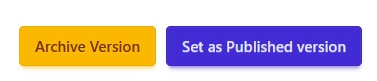

# Creating and Publishing ChatBot Versions

These steps explain the workflow for creating new chatbot versions and publishing versions, illustrating the [Versioning](../concepts/versioning.md) feature.

When a chatbot is first created, it has two versions: a published version and an unreleased version as shown below.

## Step 1: Edit your chatbot

When changing your chatbot in the pipeline builder UI, you are always editing the **unreleased** version. 

## Step 2: Create a new version

Once you have tested and are ready to release the chatbot, create a new version by clicking the **Create Version** button in the versions table. 

## Step 3: Review and save the version

You will be taken to the create new version page, which shows you the difference between the most recent version and the unreleased version. The most recent version may be different from the currently published version.

Pressing the **Create** button saves the current configuration of the chatbot and allocates it a version number.

Here you can:

- Add a description to help identify what changed.
- Check **Set as Published Version** to make this version live immediately.  

## Step 4: Confirm and test the version

You will be directed back to the versions table. It may take a few minutes for the new version to be fully available and listed in the table. From the table, you can select which Chatbot version you want to open a web chat with for testing. 

## Step 5: Publish the version
Click **View Details** on a version listed in the table, which shows summary details and which gives you the ability to set it as the published version or archive it.

## Step 6: Check what version is published
To quickly see which version is currently published, look for the green version badge next to the chatbot name at the top of the chatbot home screen. In the example below, "v2" is the published version. You can also confirm this in the table by looking for the checkmark in the published row.

